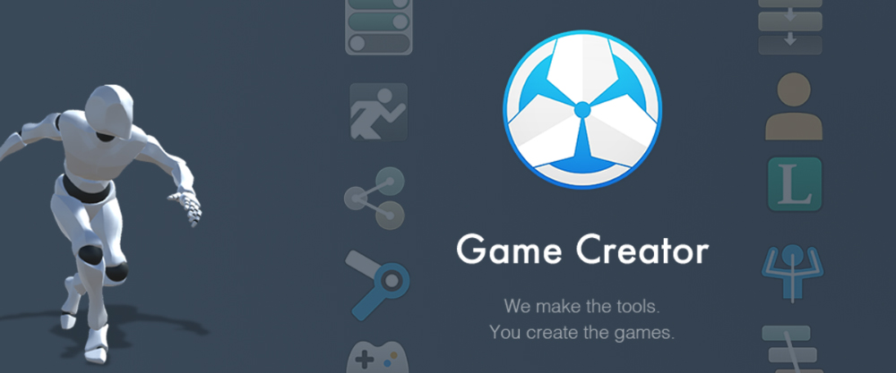

# Welcome to Game Creator!

**Game Creator** is a set of tools that will help you kickstart your game in matter of minutes. It comes packed with ready-to-use fully animated **characters**, a flexible high-level **scripting language**, a complete save & load system with local and global variables, and much, much more!

On top of all these, **Game Creator** also comes with a state-of-the-art **module manager** that allows to create, distribute and update extension packages. 

For example, the **Inventory** module allows to add a complete Inventory to your game with crafting recipes, usable items and customizable effects. The **Dialogue** module allows to have cinematic conversations between characters with branching options, timed choices, ... You name it!

## Useful Links

* [Get Game Creator](https://www.assetstore.unity3d.com/#!/content/89443?aid=1100l36uR)
* [See our Store](https://store.gamecreator.io)









* [@catsoftstudios](https://twitter.com/catsoftstudios)
* [hello@catsoft-studios.com](mailto:hello@catsoft-studios.com)


Join the Game Creator [Discord server](https://discord.gg/WUTVJeq)!


