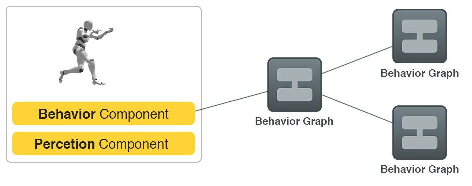
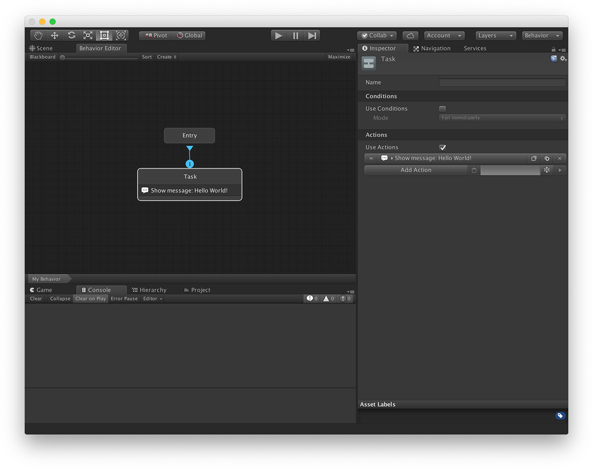
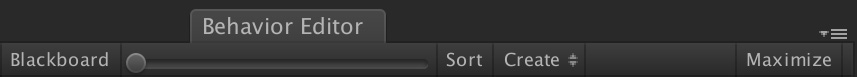
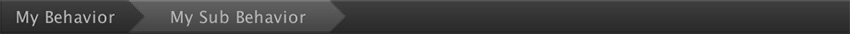

# Behavior Graph

A Behavior is defined by a **Behavior** component, which is linked to a **Behavior Graph** object. In this section, we'll focus on the **Behavior Graph**, which tells the targeted game object what to do based on a set of inputs.

## The Behavior Graph asset

To create a Behavior Graph asset right click on your Project Panel and select **`Create → Game Creator → Behavior → Behavior Tree`**. You can name it however you want as well as place it anywhere. 


We recommend creating a **`Behaviors/`** folder at the root of your project and organize all your trees there.


## The Behavior Graph Window

To bring up the Behavior Graph window simply go to the top toolbar and select **`Window → Behavior`**. Alternatively, when you double click on a **Behavior Graph** asset it will automatically open the window.

The Behavior Window is split in different sections: 

### Top Toolbar

This section is one of the most important sections of the entire module.

The **Blackboard** button toggles the [Blackboard](blackboard.md). 

The **Slider** next to it is the amount of zoom. You can either drag it or use the mouse wheel to zoom in/out of the Canvas. 

The **Sort** button re-arranges your nodes based on their size and dependencies. It is highly advisable to click it every once in a while. 

The **Creator** button opens a dropdown of options which place nodes on the node Canvas. See the [Nodes](nodes.md) section for a full list of all available nodes. 

The **Maximize** button maximizes the window for maximum comfort.

### The Canvas

Here is where the magic happens. The **Canvas** entry point is a special node called **Root** or **Entry**. The rest of the nodes are children of the root and there can't be any cycles \(hence the name _tree_\).

Click [here](nodes.md) for more information about Nodes and how they are executed.

### Breadcrumbs

A Behavior Graph can use other Behavior Graphs as nodes. When you enter on a Behavior Graph node you can quickly go back to any of its parent's Behavior graph.


It's highly recommended to group your behaviors in sub-behavior graphs. Doing so will allow you to reuse behaviors such as a _wandering_ behavior for both an _Archer_ and a _Guard_, but still have complete different behaviors when spotting the player and switching to an _attack_ behavior.


