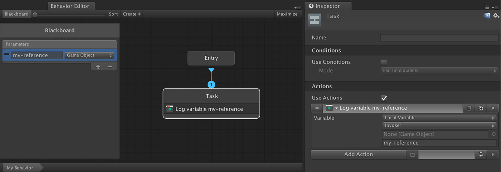
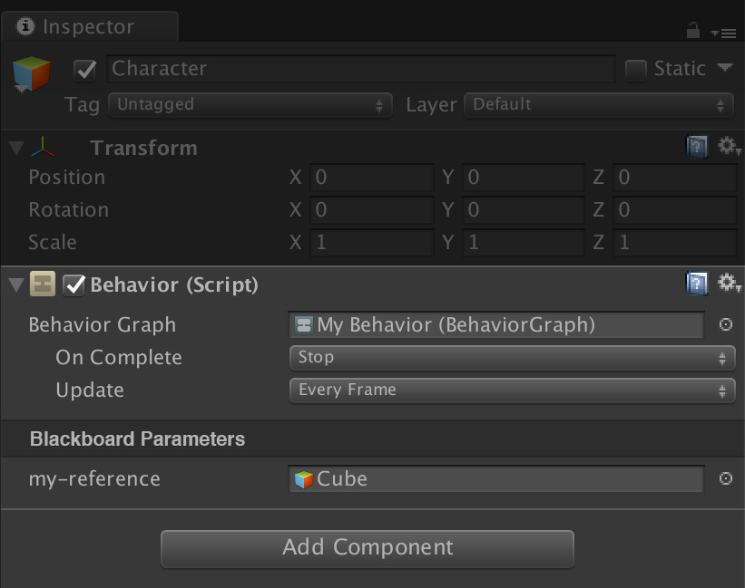
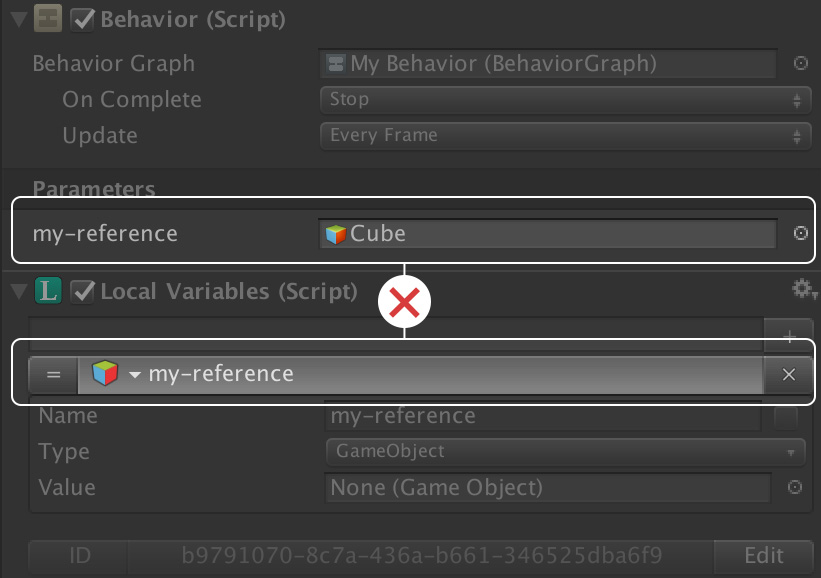

# Blackboard

**Behavior Graphs** can not reference scene objects due to living in the Project Panel. To overcome this, we've created the **Blackboard**, where the developer writes down the input fields he/she'll need and these are filled at runtime.


As you may have noticed in the image above, to access the value of a **Blackboard** entry is done as if it was a **Local Variable**. This is because under the good, the **Behavior** component generates a new **Local Variable** component and fills it with all the entries from the **Blackboard**.


Once the **Blackboard** is filled with some entries, the **Behavior** component is automatically updated, adding new entries and removing those that no longer exist in the **Blackboard**.

For example, let's say our game has a _Guard_ that can attack anything when it has a **`target`** defined. We could create a **`target`** entry in the **Blackboard** and ask if it's different than _null_. If so, follow it and attack when it's within in range.


Because the **Behavior** component generates a **Local Variable** object with the **Blackboard** entries, it will throw a conflict error.


