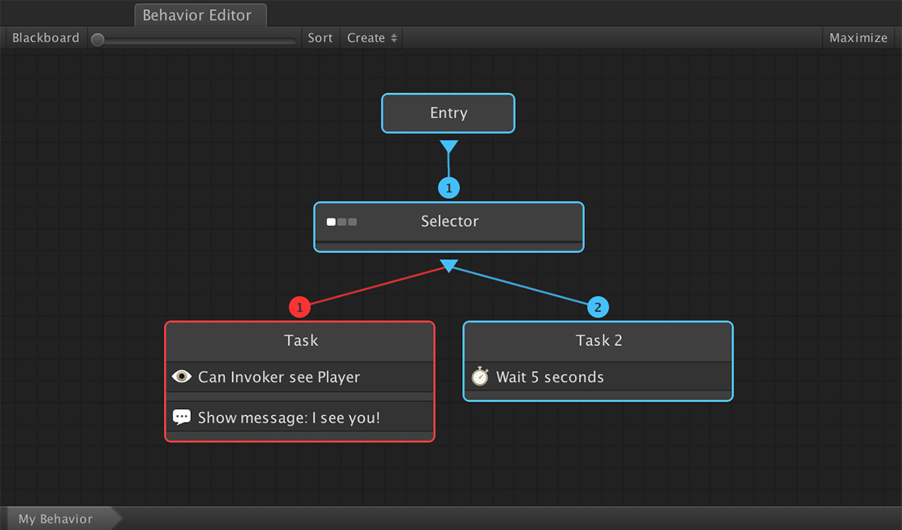
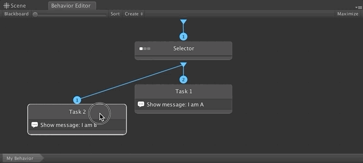
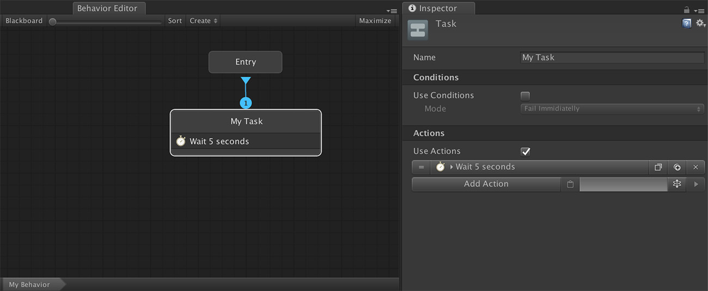
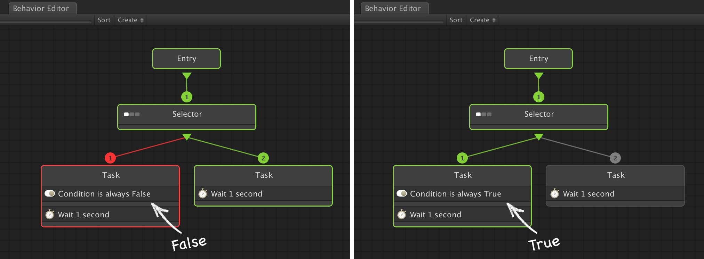
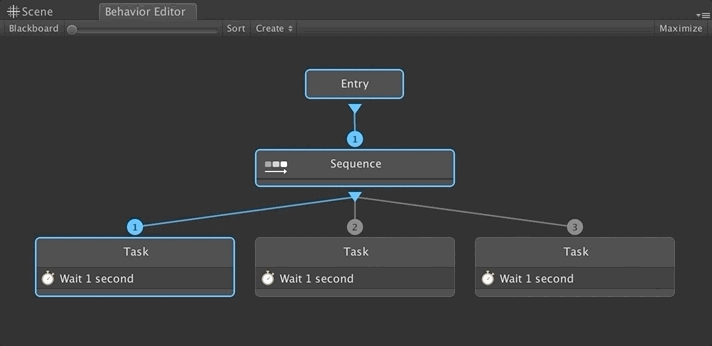
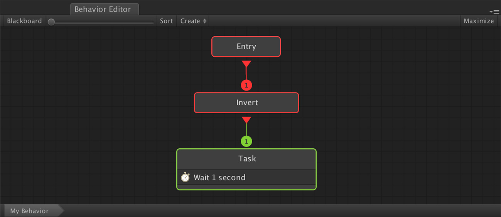
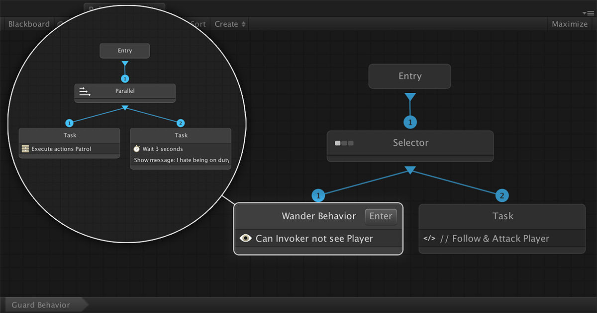

# Nodes

Before getting hands on, we'll first overview how a standard _Behavior Tree_ system works and then we'll break down each node one by node and explain what they do.

## Behavior Trees

A **Behavior Tree** is a tree-like structure that is executed from top to bottom, left to right. Each node can in one \(and only one\) of the follow states:

* **Ready:** The Node is yet to be executed. This is the default state
* **Running:** The Node is being executed
* **Success:** The Node has been executed and has successfully finished
* **Failure:** The Node has been executed but has failed


A common misconception is that a **Failed** state is due to an error, which is not true. A **Fail** state could be due to a character not being able to see the Player and moving on to checking another condition.


The example from above shows a very simple **Behavior Tree** that outputs a message if it sees the player. Otherwise, it just waits 5 seconds.


Notice that the **Selector** children have a number above their connection. This number indicates who's going to be executed first. In the previous example, the **Task** will be executed before **Task 2**.


To change the order in which two nodes are executed, simply drag the highest priority one on the left side and the order will be automatically updated.

In a **Behavior Tree** there are 3 types of nodes:

* **Tasks:** Which do one single action and return success or failure
* **Composites:** Which branch the execution of Tasks or other Composites
* **Decorators:** Which manage the state of lower nodes.


Our implementation includes a couple more: The **Entry** node and a node that executes another **Behavior Graph**.


## Types of Nodes

There are 5 types of nodes which can be used in a **Behavior Graph**. 


Users who have no prior experience with **Behavior Trees** might find it a bit daunting all these concepts. In that case, just know that the most used ones are **Composites** \(Selectors and Sequences\) and **Tasks**.



**IMPORTANT!** A **Behavior Graph** does not have access to Scene objects and thus, can't directly reference them. Use the [Blackboard](blackboard.md) to communicate input data from the scene to the **Behavior Graph**.



**EVEN MORE IMPORTANT!** The _**Invoker**_ property in a **Behavior Graph** always references the scene object that is executing the **Behavior**. 

**Example:** if you want to make a _Guard_ follow the _Player_ when he sees it, use the **Follow Character** **Action** with the _Character_ property set as _**Invoker**_ and the _Target_ as the _Player_.


### Root / Entry

This node marks the beginning where the **Behavior Graph** will start executing. There can only be one per **Behavior Graph**. It does nothing more than start executing what's below it and returns the state of the executed node.

### Tasks

A **Task** node executes zero or more **Conditions**. If these **Conditions** are met, it will execute zero or more **Actions** \(which will return a state of **Running**\) and will finish with a **Successful** state. If these **Conditions** did not succeed, the **Task** will return **Failure**.

### Composites

**Composite** **Nodes** are the most complex ones. There are different subtypes of **Composites**, but they all have in common that there are multiple branches hanging and them.

#### Selectors

**Selector Composites** tries executing the left-most child. If it's successful, the **Composite** returns **Success**. Otherwise, tries to execute the next node. If all children return failure, then the **Composite** also returns **Failure**.


**Selector** nodes can be seen as an OR of its children.


#### Sequence

**Sequence Composites** start executing the left-most child. If it's successful, it tries executing the next node. If a child returns failure, the **Composite** stops and returns **Failure**. if all children have returned success, the Composite returns **Success**.


Sequence nodes can be seen as an AND of its children.


#### Parallel

**Parallel Composites** start executing all children at the same time and its state will be **Running** until all its children have finished \(with either success or failure\). A Parallel composite will return **Success** if at least one child was successful. Otherwise it will return **Failure**.


**Beware of Parallel Node conflicts.** If the first child of a **Parallel** composite tells the a character to follow an object and a sibling tells it to move somewhere else, it is not guaranteed which one will prevail since both are executed at the same time.


#### Random Selector & Random Sequence

These special composites work the same way as their homologous, but the order in which its children nodes are executed is randomized every time the Composite is restarted.

### Decorators

**Decorators** are a special kind of nodes that don't do anything, but change the behavior of the **Behavior Graph** through the manipulation of other node states. A **Decorator** can only have one child.

For example, the **Invert** decorator will transform the output of is child and invert the result; If it was **Successful**, it will return **Failure**, and if the child returned **Failure**, it will return **Success**.

### Sub-Behavior Graph

This node isn't part of the standard **Behavior Tree** specification \(if there is one\), but we felt it was really worth adding it. It allows you to execute an entire Behavior Graph as a node.

This is very useful when creating large trees or you want to share functionality between different behavior objects.


For example, let's say we have two agents: An _Archer_ and a _Guard_. These two will attack the player on spot and they will do it using their own behavior \(the _Archer_ will keep the distance while the _Guard_ will rush head on\).  
  
These two behaviors might have in common that, when the player is not on sight, they wander around the scene. You can use a separate **Behavior Graph** asset called "Wander Behavior" and reuse it on both the _Guard_ and _Archer_ **Behavior Graphs**.


