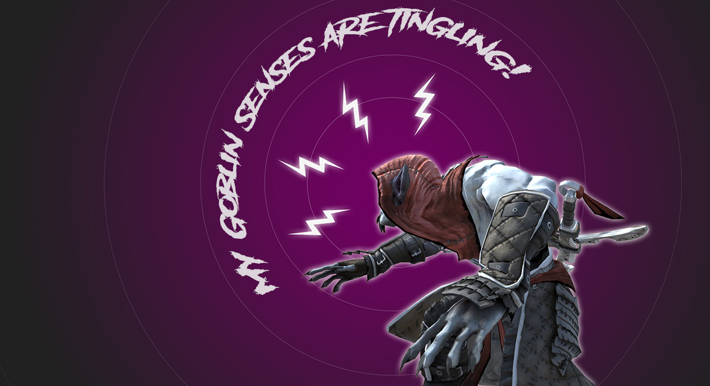
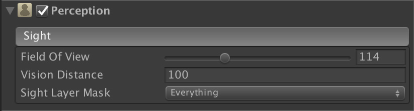
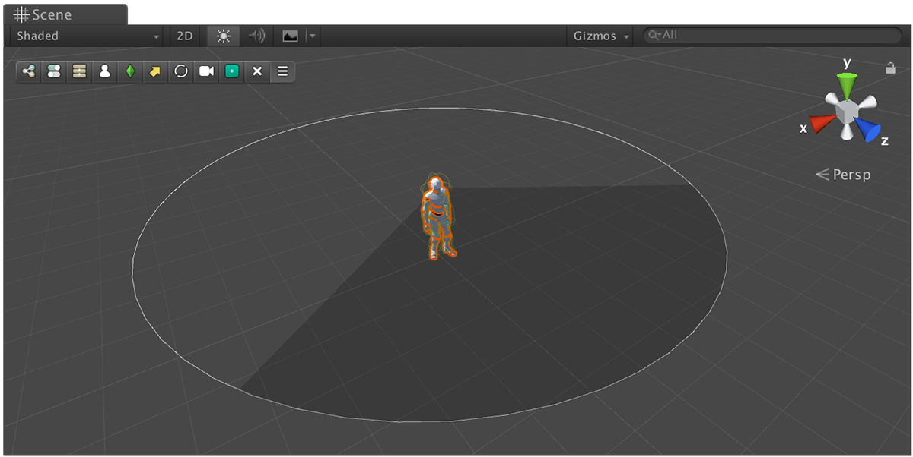
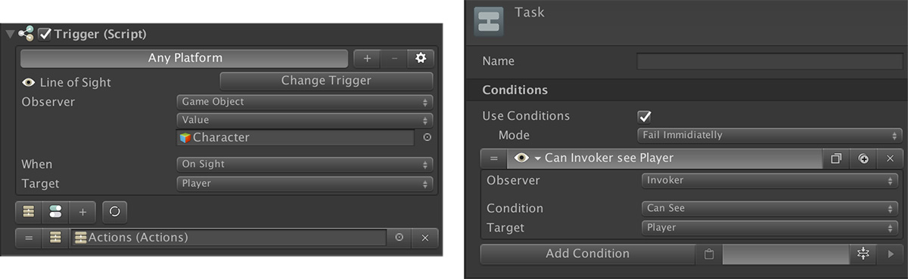

# Perception

An intelligent agent is more than a bunch of conditions and branching logic. It has to be aware of its surrounds, as well as know to to discern what is something that is important enough to  catch its attention than from scene foliage.


The **Behavior** module is still in Beta and only one **Perceptor** is available: _**Sight**_. _**Smell**_ and _**Hearing**_ are coming soon.


## Perceptrons

The **Behavior** module comes with a **Perception** component that addresses this problem. This **Perception** component comes with different _**Perceptors**_ \(aka _Senses_\) that the agent will store in its memory and keep track of them.

### Sight

The most common perceptron. Sight allows an agent to know the location of another object and identify it.


For example, a _Guard_ might be in search for the player. The **Sight** perceptron, then,  is set up to keep track of the **Player**.


* **Field of View:** Vision cone for the character. The human eye has a cone of 120 degrees, but can perceive movement a bit further.
* **Vision Distance:** Length where the horizon is drawn for the character.
* **Sight Layer Mask:** Which objects occlude other objects. Transparent objects should be added in a separate layer for a character to see through them.

There are two ways you can use the **Perceptrons**. One is through the use of a **Trigger**. The other one is using a **Condition**.

You can make a **Trigger** execute a list of **Actions** or **Conditions** detecting when an object becomes visible by the **Perception** component.


We recommend using the **Trigger** method unless you're working with the **Behavior Graph**, which might suit better just checking whether the _Invoker_ sees a particular object.


