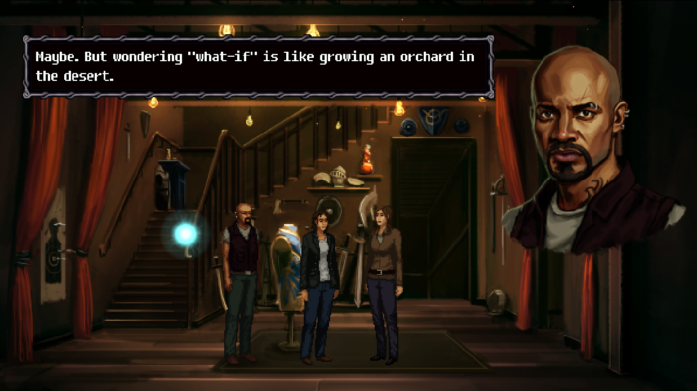
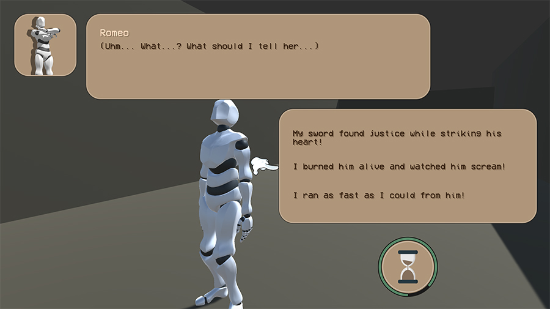
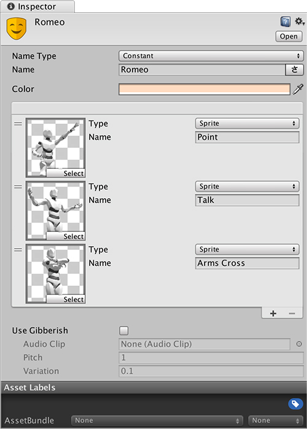
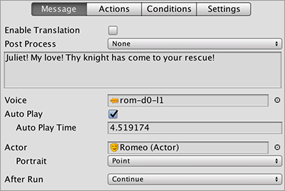

# Actors

Games that don't provide audible feedback or voice overs usually have a portrait and/or the name of the speaker so that the player knows who's saying what.

In **Dialogue 0.4.1** we introduced a new feature called **Actors**. These allow to define a character's properties in a self contained object which can then be used in a **Dialogue** that will feed this information to the UI.

To create an Actor object, right click on the Project panel and select **Game Creator → Dialogue → Actor**. You can move the newly created object anywhere in your project and organize them as you see fit.

## The Actor

The **Actor** object is a _Scriptable Object_ that contains a number of pre-defined fields. These fields are:

* **Name**: It can either be a localized constant string or a reference to a Game Creator _Global variable_.
* **Color**: A color than can be used to highlight something by the actor, such as its name.
* **Avatars**: A collection of avatars identified by a name. An avatar can either be:
  * **Sprites**: Used in an Image component.
  * **Textures**: Used in a Raw Image component.
  * **Prefabs**: Instantiated inside the Dialogue UI per dialogue line.
* **Gibberish**: Settings for an intelligible sound played word-by-word, most commonly used in the early 90s era.


The most used **Avatar** system is using **Sprites**. The other types \(specially the **Prefabs**\) might require some knowledge on modifying Unity UI elements to adjust them to your needs.


## Using an Actor

Once you have an **Actor** object you can immediately use it to customize how the **Dialogue** lines look like. To do so, you just need to drag and drop the **Actor** object into the **Actor** field.


Once you link a **Dialogue** line with an **Actor** object, more options will appear below, such as selecting which **Avatar** to use from the list of pre-defined avatars.


