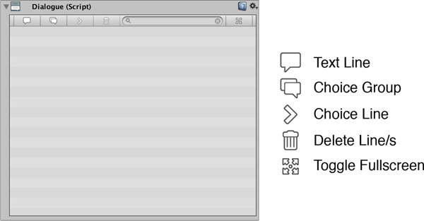
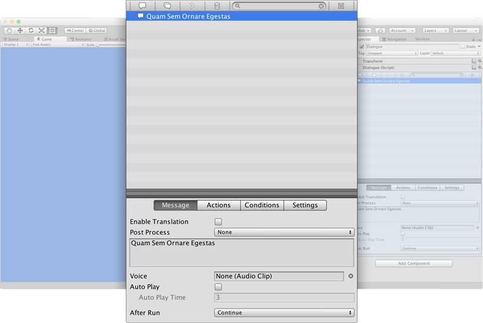
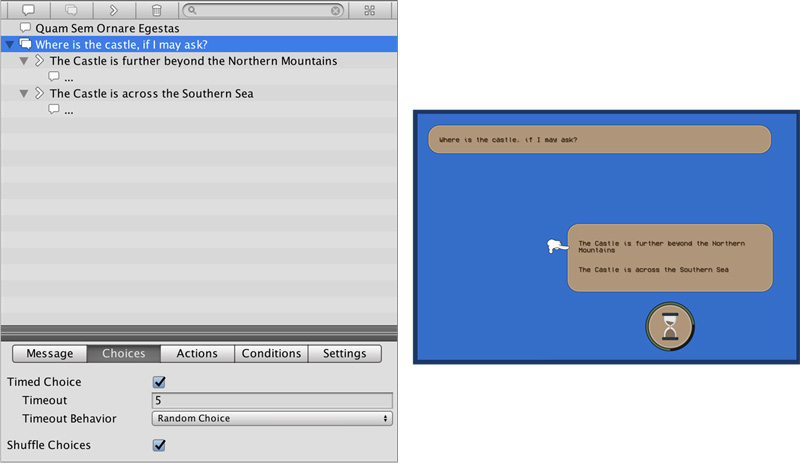

# Anatomy

## Dialogue Anatomy 

The Dialogue module is a **Component** that can be attached to any scene Game Object or _prefab_. To create one, right click on the _Hierarchy Panel_ and select `Game Creator → Other → Dialogue`.

## The Toolbar 

The **Toolbar** is where all the Dialogue items are created. It's located at the top of the Dialogue component.

* **Add Text:** Create a dialogue line.
* **Add Choice Group:** Prepare the Dialogue for a set of choices.
* **Add Choice:** Can only be added below a Choice Group. Represent a choice line.
* **Delete element/s:** Removes all selected items.
* **Search:** Type to search a specific line of dialogue.
* **Maximize/Minimize:** Toggle between fullscreen and normal mode. Useful for large conversations.

## Dialogue Elements 

Any **Dialogue** is composed of the combination of 3 types of elements: **Text**, **Choice Groups** and **Choices**.

### Text Elements 

The most common element on a conversation between characters. The Text element allows to display a text following a set of rules defined by the **Conditions** tab and execute a set of **Actions** \(if any\) that can be found in its homonym tab. If a custom skin is provided, it will use it for this specific line of text. Otherwise, it will use the one set in the _Preferences Window_.


It is highly recommended that you play a little with the different options and familiarize with can be done with the **Dialogue** module.


Additionally, you can also specify what happens after executing a **Text** element. The default behavior is that it continues to the next one \(which is the most common option\), but sometimes you might want to end the conversation upon reaching a certain point or jump to a previous node.

To do so, change the **After Run** property to **Exit** to end the dialogue or **Jump** to jump to another dialogue line. **Continue** will jump to the next element \(if any\).

### Choice Group & Choices 

**Choice Group** and **Choice** elements go hand in hand. A **Choice Groups** behaves like a **Text** element, but also allows to specify the characteristics and settings of the following choices presented to the player.

For example, imagine there's a _Merchant_ that asks for directions to _The Castle_. The choices presented to the Player could be:

* "The Castle is further beyond the Northern Mountains"
* "The Castle is across the Southern Sea"

The **Choice Group** will allow you to configure if this choice is a **Timed Choice** as well as specify how much time has the player to make a choice. Also, if it's a timed choice, you can specify what happens if no choice is made:

* Select first choice
* Select a random choice
* Skip the entire choice group

A **Choice Group** will also allow you to randomly shuffle all choices at runtime.

On the other hand, a **Choice** element will work as a "gate" to a specific choice. They work more or less like a **Text** element. The difference is that only the player can use one.

### Tips & Tricks 

See there's a **Condition** tab inside a **Text Element**? These _Conditions_ are checked before running the text line. If the result is negative, the line will be skipped.


You can take advantage of this and skip entire conversations by dragging and dropping **Text Elements** inside another **Text Element**. If the upper-most element's _Conditions_ evaluate as `false`, any of its children will be shown.



You can also use **Global Variable** values inside your texts. To do so, use the **`global[name-of-your-variable]`** syntax.


