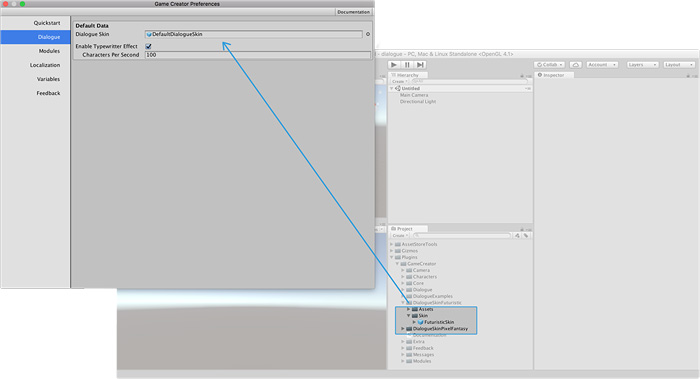

# Dialogue UI

The **Dialogue** module is 100% customizable and isn't restricted by any type of UI style. The Dialogue module comes with two skins that can be easily swapped between them.

## Using a Skin <a id="using-a-skin"></a>

A **skin** is a prefab that is used whenever a conversation line or choice is displayed. They are automatically managed by the **Dialogue** module.

To use a **skin** all there is to do is to drag and drop the _Skin Prefab_ onto the **Dialogue Skin** field found in the preferences menu.



Additionally, each **Text Element** has its own unique **Skin** field in case you want to change the skin for a particular conversation line. Otherwise, the default skin will be used.

## Create a custom skin

To create a custom Dialogue skin, we recommend duplicating the default skin prefab and modify that one. You can find the default skin at:



```text
Plugins/GameCreator/Dialogue/Resources/GameCreator/DefaultSkin.prefab
```



You can place the duplicated anywhere you want in your project. To modify it, drag and drop it in the scene, make whatever changes you want and don't forget to hit "**Apply Changes**" in the Inspector! Otherwise your prefab won't be saved.


We recommend placing the prefab somewhere different than the **`Plugins/GameCreator/`** subfolders. Otherwise, when you update **Game Creator** or any other module your prefab may be destroyed.


Once you're happy with your new skin, you can safely delete it from the scene \(remember to apply the changes!\) and drag and drop this new prefab into the **skin field** in the _Preferences Window_ Dialogue tab.

