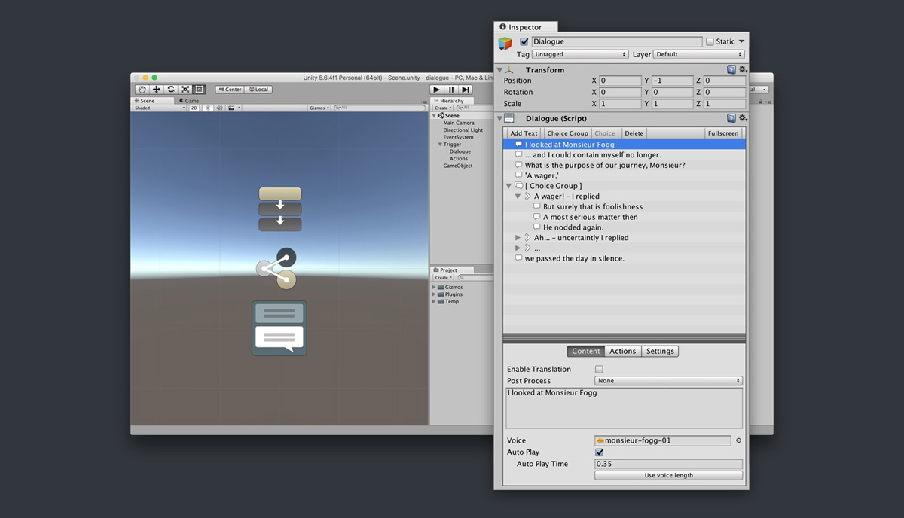

# Overview

The **Dialogue** module is a **Game Creator** extension that allows to create and display in-game cutscenes and branching conversations between characters.

## Key features {#key-features}

* Easily create **conversations** between Characters
* Add custom skins or download pre-made ones from the [Game Creator Store](https://store.gamecreator.io/)​
* Add **Conditions** to each line of dialogue
* Choose to execute Dialogue **Actions** first, last or simultaneously with the conversation line


**Dialogue** comes a minimalist skin. You can create your own by duplicating the default one or import one from the store.


## Setup {#setup}

Download the package from the Game Creator Store or the Unity Asset Store. You'll first need to have Game Creator installed.

Then, bring up the _Preferences Window_ clicking on the Game Creator option in the toolbar. Head to the **Modules** tab and click the Dialogue's **Enable** button.


This module requires **Game Creator** and won't work without it. Don't attempt to extract the package inside the Plugins/ folder as it will throw some errors.


