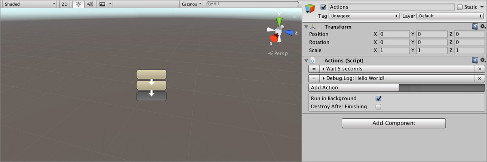
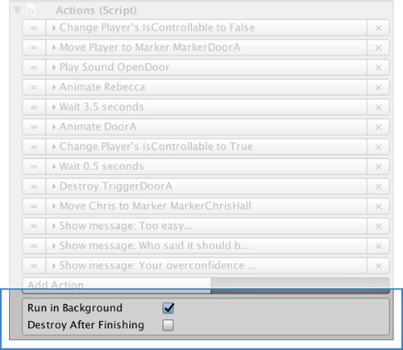

# Actions

**Actions** are one of the core features behind **Game Creator**. They allow to animate characters, activate interruptors, move objects, and a long etcetera.

## Creating an Action

To create an **Action**, right click on the _Hierarchy Panel_ and select `Game Creator → Actions`. Alternatively you can also add the **Actions** component to any **Game Object** or click on the **Actions** button from the [Game Creator Toolbar](../systems/game-creator-toolbar.md).

## Anatomy of an Action

An **Action** is a single instruction that when executed _"does something"_. For example, the action **Wait** puts the execution on hold for a number of seconds.

Here's an example of an action called **Play Sound**.


When an **Action** is executed in runtime it will be highlighted in **light blue**. This is very useful when you want to track which instruction is being executed.


To add a new Action click on the **Add Action** button. A categorized dropdown window will appear. You can navigate using your _mouse_ or the _keyboard_. 

Select which action you want to add and it will automatically be added at the end of the list.

## Behavior Options

You can configure the behavior of an **Action** at the end of the component.

### Run in Background

When the `Run in background` checkbox is marked the **Action** will always be executed when called. If the checkbox is left unmarked, if another **Actions** object is being executed and is set to run in the foreground, the first one won't be executed.


In other words, two **Actions** can't be executed at the same time if they both have the **Run in background** checkbox unmarked.


### Destroy After Finishing

**Game Creator** is all about fast development. If you want to destroy an **Actions** object after all its instructions have been executed, mark this checkbox.


You can accomplish the same behavior using the **Destroy** action at the end of the container of **Actions**., though it's faster this way.



You can add an **Actions** component below a **Trigger** component and let the **Destroy After Finishing** option destroy both the **Actions** and the **Trigger**. Useful if you want to execute it only once, for example, when picking an item.


