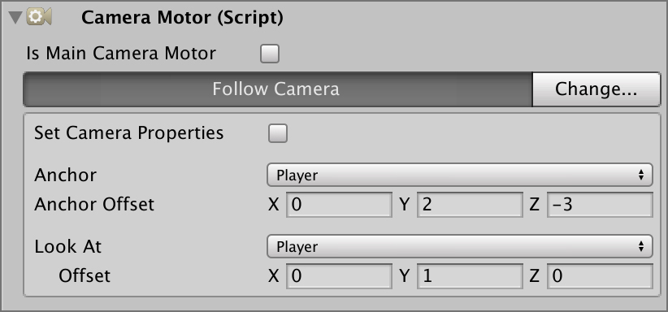
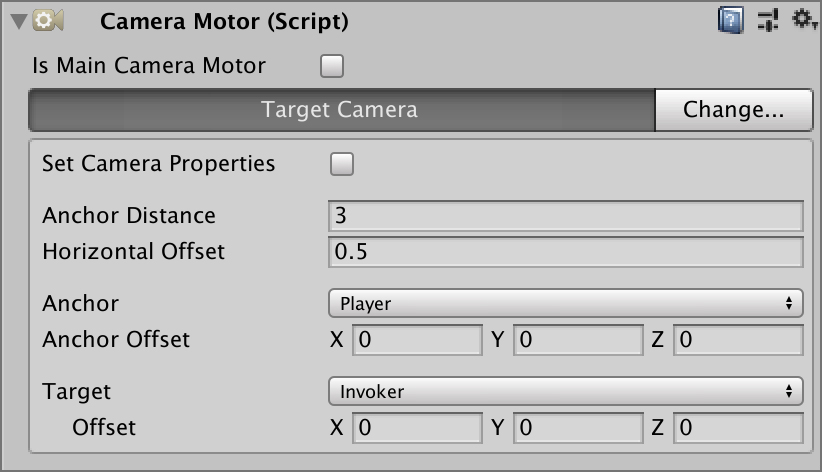
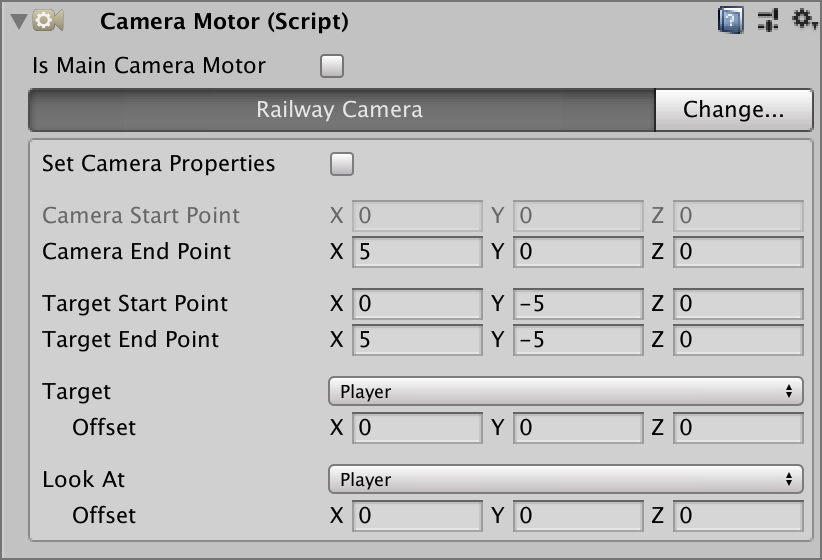
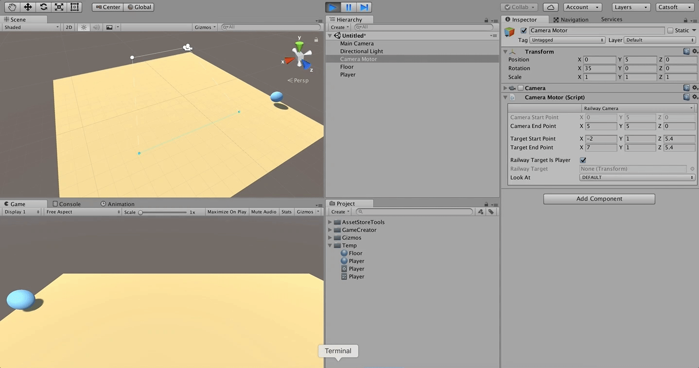
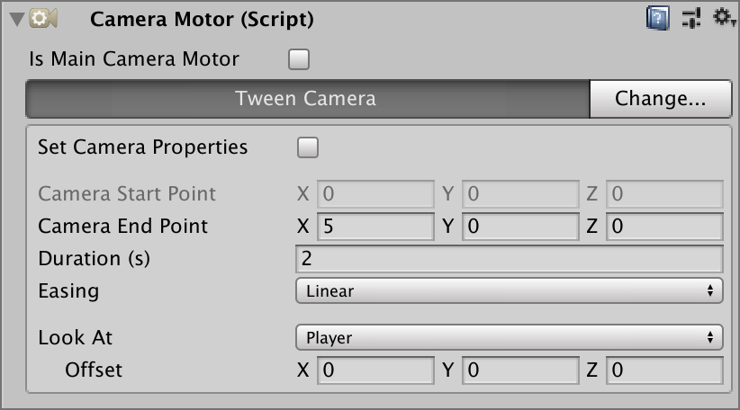
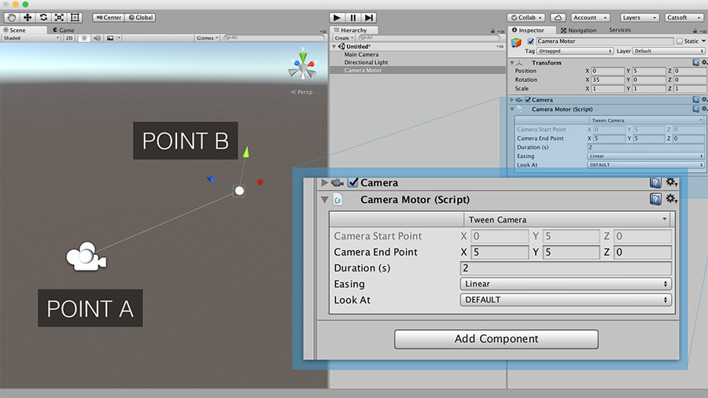
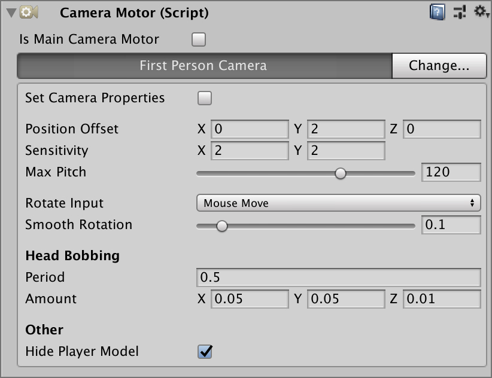
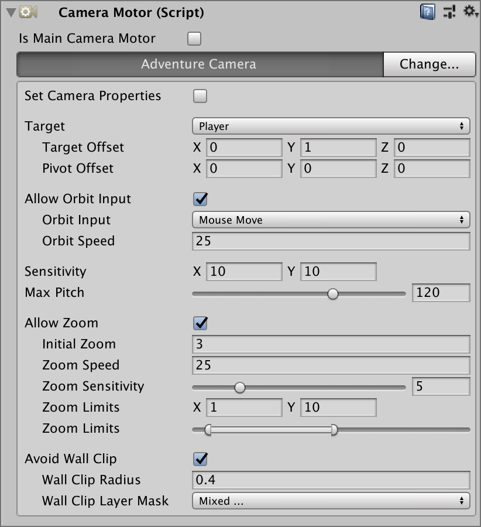

# Camera Motors

**Camera Motors** tell the **Camera Controller** where and how to look at the world. There are a bunch of different types of motors.

## Fixed Camera Motor 

This is the simplest type of **Camera Motor**. It stays at a fixed position, just like a _surveillance security camera_ and it can rotate to look at different types of targets.

* **Default**: Doesn't rotate
* **Player**: Looks at the player
* **Target**: Looks at a specific target
* **Position**: Looks at a specific world-space position

## Follow Camera Motor 

The **Follow Camera Motor** is similar to the **Fixed Motor** as it allows to look at a specific target/position/player but it also allows to follow it.


This type of camera is usually used for **RTS** or **Top-Down** games.



Add a little dampening to the **Camera Controller** to avoid jittering.


## Target Camera Motor 

The **Target Camera** behaves much similar like the **Follow Camera** but also accepts a **Look At** target. It's mostly used for _Shoulder_ cameras where the camera is anchored to a position \(Player's shoulder\) but the focus of the camera is targeting another scene object.


This camera can also be used to highlight a place of interest


## Railway Camera Motor 

The **Railway Camera Motor** is a little bit more sophisticated type of motor. It allows the camera to follow the target along a path \(or rail\) but never exceed it.

Railway Cameras are a bit difficult to understand at first but are a powerful tool to create cinematic experiences.

The player \(_blue ball_\) moves from right to left. When the player is within the _plane_ of the blue line, the camera linearly interpolates the player's position with its min-max path.


In other words, the camera follows the **Player** as long as the **Player** is within the blue line. Otherwise it stays at the edge of the path.


This type of cameras are very useful for corridors or narrow rooms.


You can modify the camera path and the player min-max path by clicking and dragging the white balls in the scene view.


## Tween Camera Motor 

The **Tween Camera Motor** allows to move the camera from a position _A_ to position _B_ within a time window. It is mostly used for cutscenes or small animations.

Tween Camera Motors are easily set up using the scene view gizmos. The motor's position corresponds to the initial position while the white dot is the end position

## First Person Camera Motor 

The **First Person Motor** allows to create FPS action games like _Call of Duty_ or horror games like The Elder Scrolls.

This camera motor allows to define the mouse sensitivity, the amount of dampening/spring the camera moves relative to the mouse and the maximum pitch rotation \(in case you want to limit the visual spectrum of the player\).

## Adventure Camera Motor 

The **Adventure Camera** is an advanced camera system that behaves like the cameras from _Tomb Raider_ or _Uncharted_ series.

The camera orbits around a target using the mouse movement \(on Desktop\) or using the touch-screen if the target device is mobile.


You can also toggle whether you want to avoid **wall collision**.


