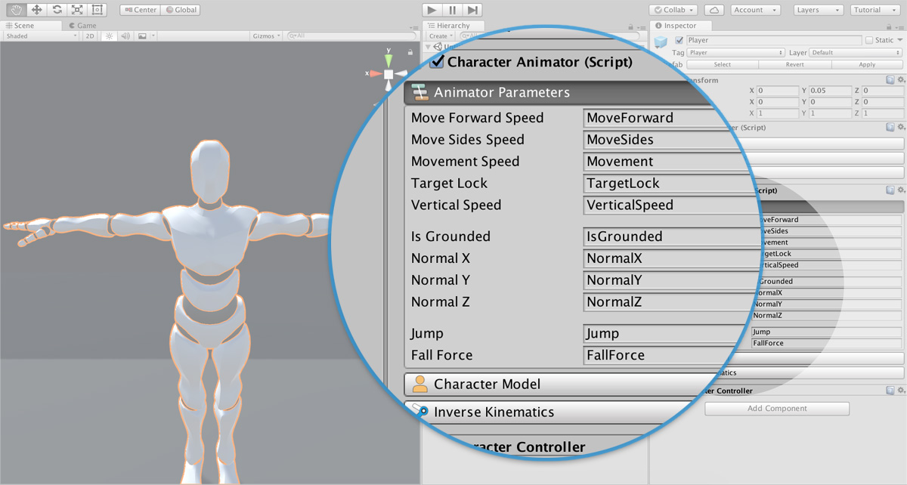
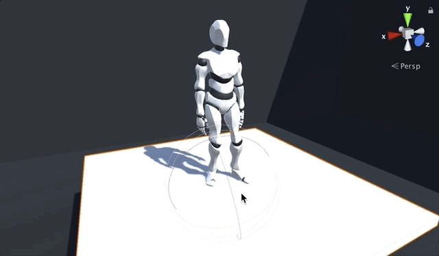

# Characters

The **Characters** component allows to define an object as a character. A **Character** can be moved around using the appropriate **Actions**. You can also tweak different properties such as if the character can _walk_, _run_, its _speed_ and more

Since version **0.2.5** a character can also perform one of multiple **gestures**, such as waving its hand, picking an object, drinking a potion, ... And be in one of multiple states, such as crouched, injured and so on.


Since version **0.2.6** a character can also **Jump**.


## Character Properties 

The **Character**'s properties is divided into two big sub-groups: The **Basic** properties, and the **Advanced** properties.

### Basic Properties 

As its name implies, the **Basic** character properties are easily understandable and directly affect the **Character**'s behavior.

* **Is Controllable:** An on/off property that allows to set a character can be controlled with **Actions**.
* **Can Run:** A toggle property that restricts the speed of the character. If set to true, the maximum speed the character can move is `runSpeed`. Otherwise the `walkSpeed` will be used.
* **Walk Speed** and **Run Speed:** The lineal speed the character moves when walking/running.
* **Angular Speed:** The speed at which the character rotates towards its desired direction expressed in **degrees per second**. If this property is set to 180, a character will need one second to turn to its opposite direction.
* **Can Jump:** Allows to give the character the ability to jump. If set to false, even if the Character receive an order from an **Action** to jump, it won't do it.
* **Jump Force:** Default jump force used by the **Player** jump input and the **Jump Action**

### Advanced Properties 

The **Advanced** character properties are meant to be modified by more advanced users who need finer-grain control over the **Player** and other **NPC**s.

* **Slope Speed Up** and **Slope Speed Down:** In real life, a human doesn't move at the same speed when running on a flat surface as it does on a steep one. This parameter allows to define the amount \(percent\) of _speed_ that is subtracted from going up or down.
* **Face Camera Direction:** If checked, the character will always face where the camera's direction. Very useful when making a game from a First Person perspective.
* **Can Use Navigation Mesh:** If checked, the character will automatically use the _Unity's Navigation Mesh_ system when moving from one point to another and change back to using the _Character Controller_ if not moving. It is recommended to use this, as it allows to avoid obstacles when moving characters around the scene.


**Can Use Navigation Mesh** is disabled by default because the user has to **Bake** the Navigation Mesh first. To know more about using the **Navigation Mesh** follow this [link](https://docs.unity3d.com/Manual/Navigation.html).


## Animating the Character 

In order to make the system more flexible, the **Character** and its animation system have been split in two different components.

The **Character Animator** has three different sections: 

* Animator Parameters
* Character Model
* Inverse Kinematics

### Animator Parameters 

These string values behave as a proxy between the **Character** component and the **Animator**, gathering locomotion information from the logic controller and plugging it into the **Animator**. The string values defined inside the **Animator Parameters** allow to have a custom **Animator Controller**.


We don't recommend tweaking these parameters unless you are certain of what you want to do. In case you want to use your own Animation solution, you can access the current **Character** state by calling a public method named **`GetCharacterState()`**. It returns a **`Character.State`** class with information about if the character is grounded or not, its direction, etc.


### Character Model 

You'll probably want to make a game with your custom character models. Luckely, changing between characters in **Game Creator** is as easy as clicking the **Change Model** button and dragging in the 3D model you want to use from your _Project Panel_. **Game Creator** will take it from here and automagically update the character with the new one.


You can also change characters in **Play-Mode** in case you want to see how they look like. Switching back to **Edit-Mode** will undo any changes made.


### Inverse Kinematics

Since version 0.4.1 **Game Creator** allows the use of **Inverse Kinematics** \(aka **IK**\). This advanced technique allows to correctly place the feet of a character taking into account the steepness of the terrain, instead of relying on the animation of the character.

**Game Creator** goes one step further and has a custom feature called **Weight Compensation**, which allows the character to slightly elevate or crouch depending on the inclination of the floor, so not only the feet are properly aligned, but also the knees gracefully bend.


Enabling **IK** comes at a performance cost of several **Raycasts** per frame. 


#### Foot IK

Foot IK allows any Character or Player to correctly align and place their feed even on steep floors.

## Custom Animations

You can play custom animations created by you or downloaded from third-party services, such as [Mixamo](https://mixamo.com). To do so, you need to make sure that the imported animation is of type **Humanoid**. 

By default, Unity imports its animations as Generic. To change the animation type, select the imported clip and click on the **Rig** tab. There you can select Humanoid under **Animation Type**. 

For more information on how to play custom animations, Game Creator provides two components built on top of the Unity's Animation system: [Gestures](gestures.md) and [States](states.md). Check them out to know how to play simple animations or even build complex locomotion movements with just a couple of clicks.

