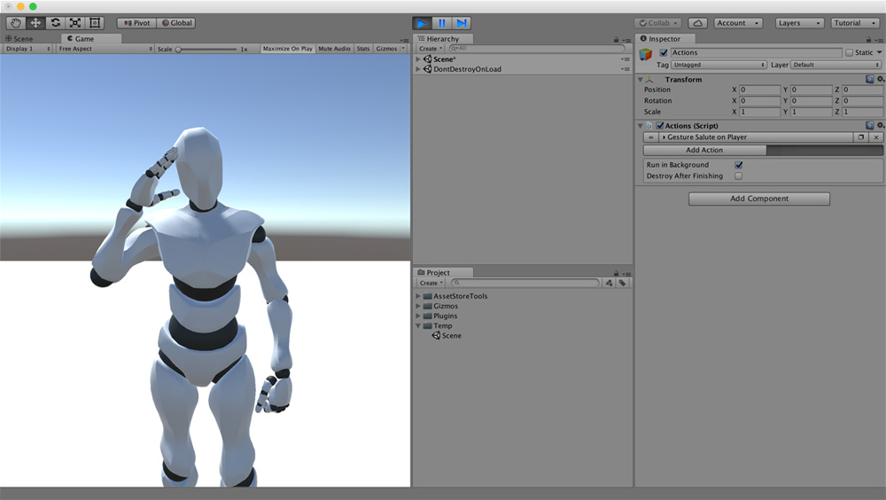

# Gestures

The **Character** with the **Character Animator** can perform multiple gestures. A **Gesture** is a small movement the character does that doesn't imply changing its state. For example, when two people interact, their hands move according to their verbal language to emphasize their communication.


Since version **0.4.1** you can add custom **Gestures** using the new animation system.


To add a custom animation, simply use the **Character Gesture Action** and drag your animation to the `gesture` field.

