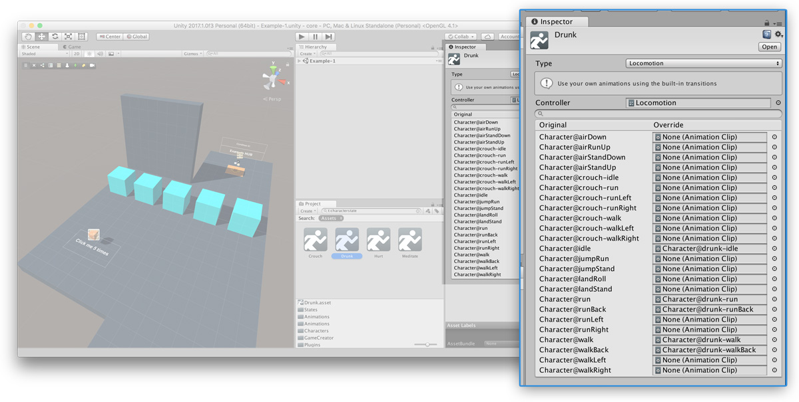

# States

Apart from performing different **Gestures**, a **Character** can also be in different **States**. The difference between a **State** and a **Gesture** is that a **State** is part of a range of Locomotion animations.

For example, you can make the **Player** enter the **Crouch** state when detecting if guards are nearby so sneak past behind them, or move around looking **Drunk**.


States are not **boolean** \(on/off\) values. You can blend between the root locomotion and a state setting the _amount_ value between **0.0** and **1.0**. 

This is very useful if you want, for instance, to set the **Player** normal-injured state based on its remaining health.


## Default States {#default-states}

**Game Creator** comes with some default **States**:

* **Crouch:** The character crouches in a stealthy way
* **Drunk:** The character appears... Not sober ^^'
* **Hurt:** The character moves hoping with just one leg
* **Mediate:** The character sits crossing its legs and placing its hands onto his knees.

## Custom States {#custom-states}

**Game Creator** allows you to easily create custom **States**. To do so, right click on the _Project Panel_ and select `Create → Game Creator → Characters` and a **State** asset will be created. You'll see there are different types of **States**.

* **Simple State:** Just like the _Meditate_ state, a simple state is a character staying in a single pose. This can be sitting on a chair, leaning on a wall, ...
* **Locomotion State:** Like the **Drunk** state, the Locomotion state is a state where you can override the different movement animations of the character. You'll be presented with a list of animation fields where you can drag and drop custom ones to.
* **Advanced State:** This is for advanced users who want fine-grain solutions or have a custom **Mecanim Animator Controller**. Drag and drop the animator and call the different parameters need \(if any\) from a custom script to use it.


If you leave any **State** animation in blank, the default locomotion animation will be used.


When using a **Character State Action** you'll have to drag and drop this **State** asset to the corresponding field and it will automagically bend between the default animations and the new state.

