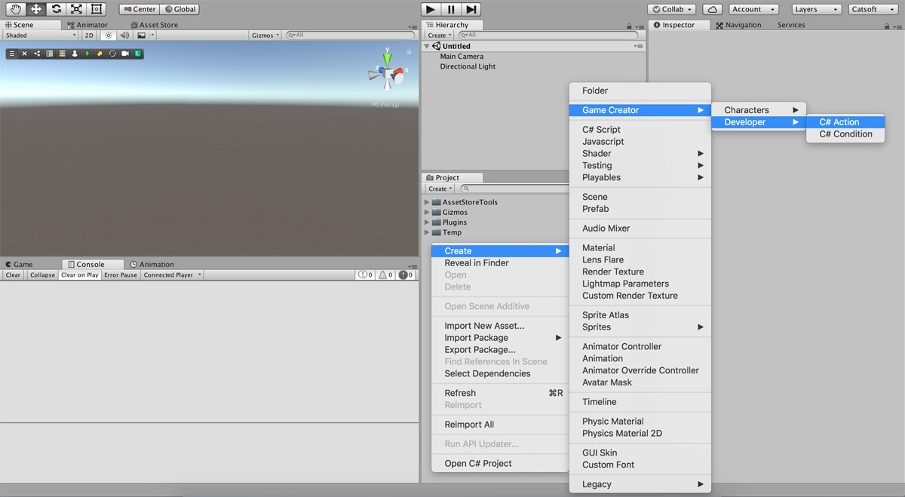
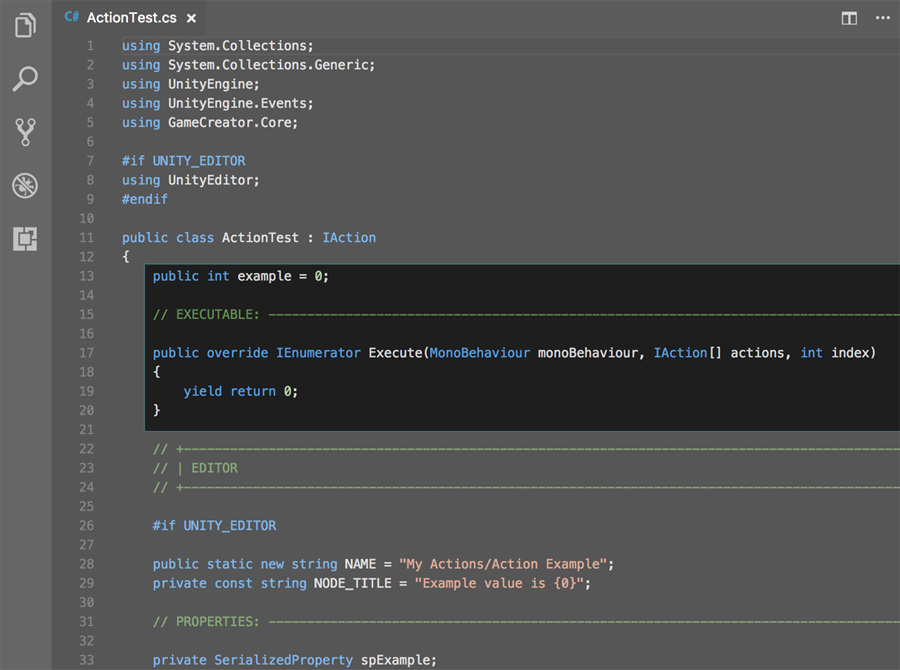
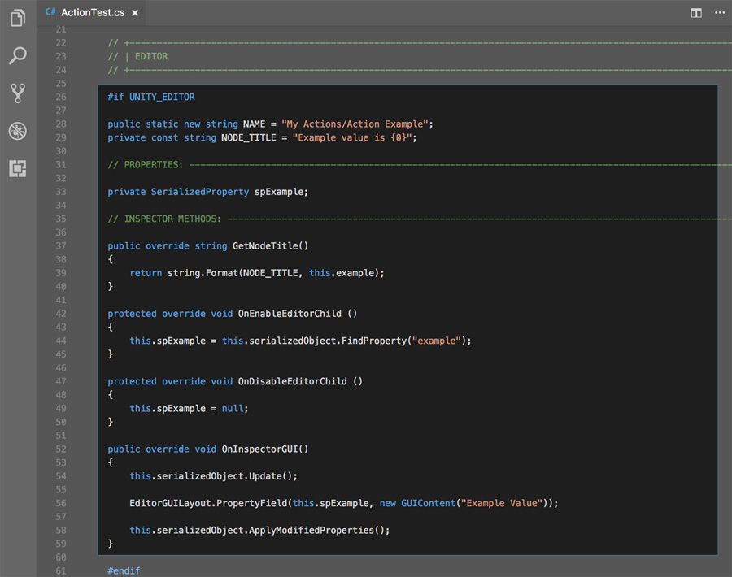
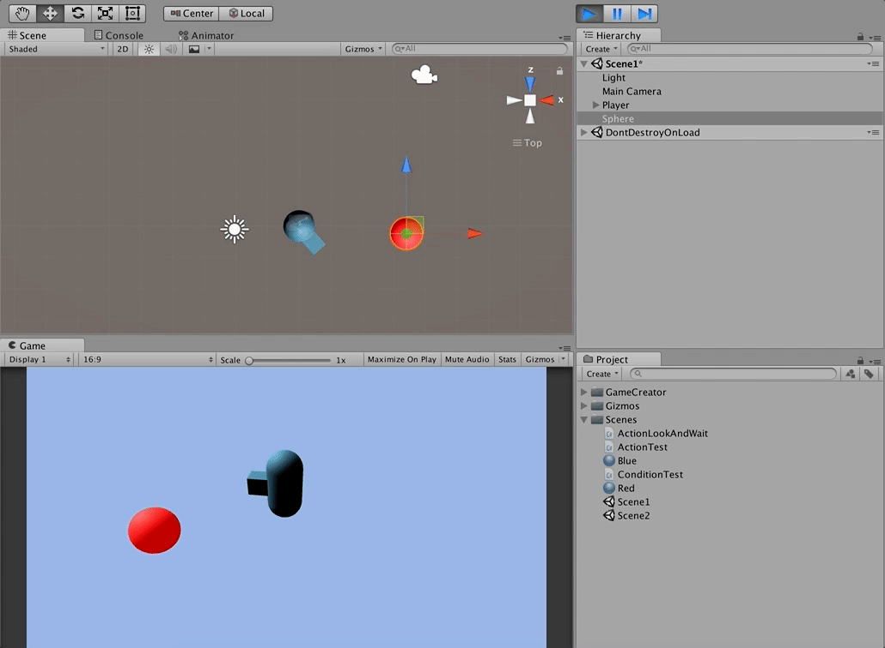

# Custom Actions

**Actions** are the heart of **Game Creator** and thus is a process you'll be doing quite often if you intent to customize your game. Luckily we've created tools that allows you to easily create a _template_ action which you can modify.

To create a new **Action** right-click on the _Project Panel_ inside the _Unity Editor_ and navigate to `Create → GameCreator → Developer → Action` and give the text file created a suitable name.




We use the convention **"Action" +** **name**, but you can use whatever you like.


Open the new **Action** and see how there's already a bunch of code written. Notice how the **Action** inherits from an abstract class named `IAction`. To create a custom **Action** you don't need to know how they work. All you have to do is fill in the methods and you'll be good to go!


All **Game Creator** scripts are organized inside the namespace "GameCreator" and each module has its own sub-namespace.


Creating a custom **Action** is divided in two parts. The first one, you'll be programming what the action actually does. The second part you'll need to tell Unity how you want this **Action** to be visualized in the _Inspector_ and which properties are exposed. Let's begin with the first one.

## Runtime Body of an Action

The runtime body of the **Action** goes from the beginning of the action class definition till the platform compile condition pragma \(where it's read `#if UNITY_EDITOR`\)



You can declare your properties at the beginning of the class as you would normally do. The method `Execute` is called whenever an action is executed. Let's break down its structure and explain how it works.

```csharp
public override IEnumerator Execute(GameObject invoker, IAction[] actions, int index)
{
    yield return 0;
}
```

Notice how `Execute` returns an `IEnumerator` type. This is because this method is a [coroutine](https://docs.unity3d.com/Manual/Coroutines.html). A coroutine works as any other function, except that it can halt its execution waiting for a value or for an amount of time. This is perfect for **Actions** as it allows to halt the execution independently of the cause.


For example, the** Move Character To** Action that allows to move a character from _A_ to _B_. You can decide whether to wait for the character to arrive to its destination or continue the execution as soon as the character starts moving.

The `Execute` method must always return A `yield return 0` \(or any other integer number\). This value is used to jump between instructions. Positive values skip forward instructions and negative ones re-execute previous instructions. By default you should always return 0.


The parameters are:

* `GameObject invoker`: References the invoker of the **Action**.
* `IAction[] actions`: An array containing the full set of instructions
* `int index`: The index of the current **Action** in the previous parameter

## Runtime Body example

Here's an example of a custom **Action** called `ActionLookAtAndWait`. What it does is to make the `objectA` asset look at the `objectB` and wait 0.5 seconds before resuming the execution.

```csharp
public Transform objectA;
public Transform objectB;
​
public override IEnumerator Execute(GameObject invoker, IAction[] actions, int index)
{
    this.objectA.LookAt(this.objectB, Vector3.up);
    yield return new WaitForSeconds(0.5f);
​
    yield return 0;
}
```


Notice how after the `yield return new WaitForSeconds(0.5)` there's one last yield instruction that returns an integer \(`yield return 0`\)


## Editor Body example

Let's take a look at the second half of the code for creating a custom **Action**. Between the platform compile condition pragmas \(`#if UNITY_EDITOR` ... `#endif`\).



First of all, there is a _static_ property with the _new_ keyword called `NAME`. This property gives the **Action** a name in the **Action**'s selection dropdown list. Just change the name and you're good to go.

The second property is a _const_ string named `NODE_TITLE`. This one is used in the method `GetNodeTitle()` which returns a string containing the description of the **Action** shown in the _Inspector_.


Instead of using a constant string, **Game Creator** gets the description of an **Action** using the `GetNodeTitle` method so it can dynamically change its content based on its properties.


`OnEnableEditorChild()` and `OnDisableEditorChild()` are called when the _Instector_ containing this **Action** is focused/unfocused. It's a good place to initialize the properties used in the `OnInspectorGUI()` method.

The `OnInspectorGUI()` is where the thick code goes. It is called every refresh frame. It should always start with `serializedObject.Update()` and finish with `serializedObject.ApplyModifiedProperties()`. Between these two lines you should show the serialized version of the properties.

For more information on working with _SerializedProperties_ follow this [Unity guide](https://docs.unity3d.com/Manual/editor-CustomEditors.html).


Unlike the `Update` method, **Editor** scripts are only refreshed when they need to be repainted.


Here's the _Editor_ code section of the **ActionLookAtAndWait**

```csharp
#if UNITY_EDITOR
​
public static new string NAME = "My Actions/Look and Wait";
private const string NODE_TITLE = "Object {0} looks at {1}";
​
private SerializedProperty spObjectA;
private SerializedProperty spObjectB;
​
public override string GetNodeTitle()
{
    return string.Format(
        NODE_TITLE,
        (this.objectA == null ? "none" : this.objectA.gameObject.name),
        (this.objectB == null ? "none" : this.objectB.gameObject.name)
    );
}
​
protected override void OnEnableEditorChild ()
{
    this.spObjectA = this.serializedObject.FindProperty("objectA");
    this.spObjectB = this.serializedObject.FindProperty("objectB");
}
​
protected override void OnDisableEditorChild ()
{
    this.spObjectA = null;
    this.spObjectB = null;
}
​
public override void OnInspectorGUI()
{
    this.serializedObject.Update();
​
    EditorGUILayout.PropertyField(this.spObjectA);
    EditorGUILayout.PropertyField(this.spObjectB);
​
    this.serializedObject.ApplyModifiedProperties();
}
​
#endif
```

Wrapping and putting everything together, you can see this custom **Action** in a real project. Notice how the square looks at the objectB \(red ball\) and waits 0.5 seconds before looking at it again.



