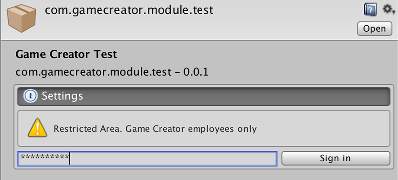
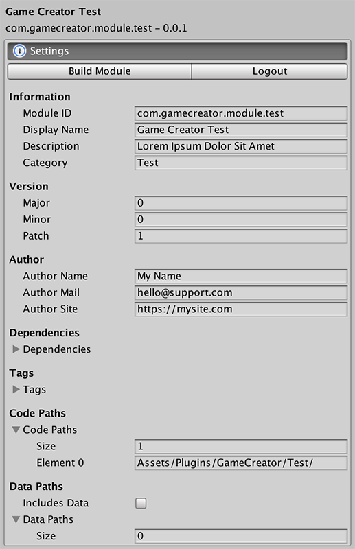

# Custom Module

**Game Creator** comes with a dependency manager called **Module Manager**. It allows to add, remove and seamlessly update extensions that add new features to our core product.


Learn more about the Module Manager [here](../module-manager.md).


All Modules are located at `Plugins/GameCreatorData/Modules/`. Modules are identified by a **unique name** or **bundleID**. You can name bundles however you want, but we recommend following the pattern:

```text
com.[company].[product-type].[product-name]
```

For example, the **bundleID** of the **Dialogue** module is `com.gamecreator.module.dialogue`. By using convention it's easier to avoid duplicate names. 

## Anatomy of a Module

A module is composed of two files. The **Unity Package** and the **Manifest** file.

The **Unity Package** contains all the assets and scripts of the module. It also knows where the files should be routed when updating or installing the module.


If you are unfamiliar with [package managers](https://en.wikipedia.org/wiki/Package_manager), imagine the **Unity Package** is a **zip** file you can decompress to access its content.


The Manifest file contains the rest of the information relative to the specific module. Manifest files are password protected so that inexperienced users don't accidentally mess with them.


The password of all Manifest files is **gamecreator** \(lowercase and without any spaces\).




After signing in the Manifest file you'll see all the Manifest options.



The Manifest can be broken down into 3 sections.

* The **Build Module** and **Logout** options.
* The **General Information**.
* The **Build Settings**.

### Build Module

The** Build Module** button allows you to pack the module into a `bundleid.unitypackage` file which can be found next to the **Manifest**.


The **Build Module** option will overwrite any existing Unity Package at that location.


The **Logout** option allows you to exit the Manifest editing mode.

### General Information

TODO

### Build Settings

TODO

