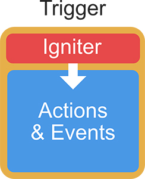

# Custom Triggers

**Triggers** are the bridge between some kind of input and the execution of **Actions** and **Events**. What receives this input and decides whether the Trigger should be fired or not are a hidden component called **Igniters**.



So when we talk about creating custom **Triggers**, we're actually talking about custom **Igniters**. And these work pretty much the same way as **Actions** and **Conditions**.



```csharp

[AddComponentMenu("")]
public class IgniterCollisionEnter : Igniter 
{
    #if UNITY_EDITOR
    public new static string NAME = "Example/Example";
    public new static bool REQUIRES_COLLIDER = true;
    #endif

    void Start()
    {
        this.ExecuteTrigger(null);
    }
}
```



In the example above you see an example of Igniter that tells the **Trigger** to fire the **Actions** and **Events** as soon as the **`Start`** method is called.

It is worth noting that it requires the static property **`NAME`** and this needs to be unique. The **`REQUIRES_COLLIDER`** property is optional and tells the Editor that this Trigger needs to have a collider attached.


Unlike **Actions** and **Conditions**, **Igniters** don't an Editor section to display the Inspector's UI


The **Igniter** class inherits from **MonoBehaviour**. That means that you have all the typical methods at your disposal, including the **`Awake`**, **`Update`**, **`OnColliderEnter`**, ...

