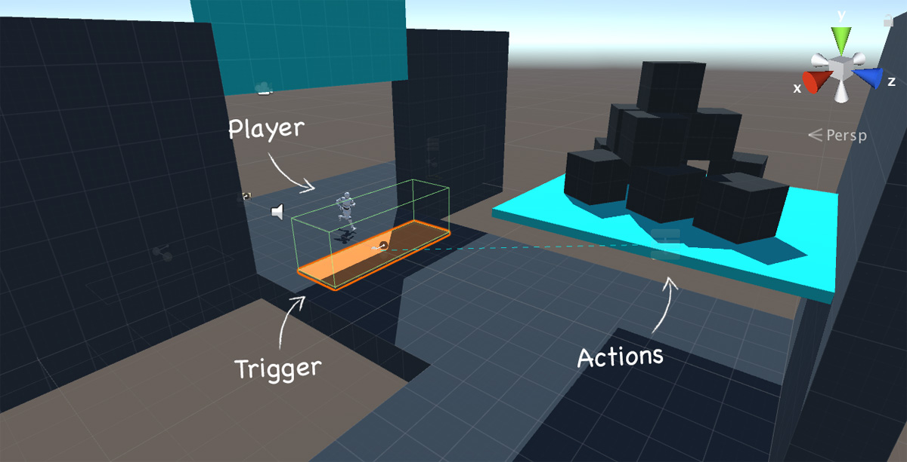

# Overview

The heart of **Game Creator** is composed of 6 different components. 

The first three \(**Actions**, **Events** and **Triggers**\) focus on giving you the tools to create gameplay mechanics and design interactive elements. The other three \(**Hotspots**, **Characters** and **Camera Motors**\) act as an interface for the previous ones between the player and interactions.

For example, a user controls a **Character** \(Player\) which when it steps on a **Trigger**, it executes a set of **Actions** \(which can be a trap where rocks fall and reduce the player's HP\)

### Actions

A set of instructions that are sequentially executed from top to bottom. For example, an Actions set could be the following one:

* Move **Player** near object **Chest**
* Play animation `Open` on object **Chest**
* Give `10 gold coins` to **Player**

Click [here](actions.md) to learn more about them.

### Events

Condition the execution of **Actions**. For example, you can check if the object **Chest** has been opened. If so, don't increase the player's `gold coins`, but show the message: `This chest has already been looted!` 

Click [here](events.md) to learn more

### Triggers

Triggers react to inputs and can execute one or more **Actions** and **Events**. For example, you can detect when the player enters a _Lava Zone_ and execute an **Action** that makes the player take damage.

Click [here](triggers.md) to learn more about Triggers.

### Hotspots

These are very simple components that are usually used together with **Triggers**. They allow to _hint_ the player about interactive elements. These _hints_ can be turned on and off depending on the type of interaction you want.

For example, you can make the **Player** turn his head towards the hotspot to indicate there's something that has caught his/her attention.

Click [here](hotspots.md) to learn more about Hotspots.

### Characters

As its name implies, **Characters** allow to easily add non-playable characters to your world using one single click.

All Characters have walk, run and jump capabilities by default. They also have procedural feet placement using Inverse Kinematics with an in-house custom algorithm called Weight Compensation.

There's a special type of **Character** called **Player** which inherits all the Character's functionalities and also allows it to be directly controlled by the user using different control schemes.

