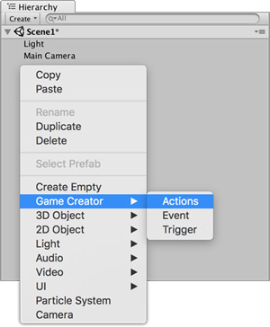

# Actions

**Actions** are one of the core features behind **Game Creator**. They allow to animate characters, activate interruptors, move objects, and a long etcetera.

## Creating an Action

To create an **Action**, right click on the _Hierarchy Panel_ and select `Game Creator → Actions`. Alternatively you can also add the **Actions** component to any **Game Object** or click on the **Actions** button from the [Game Creator Toolbar](../game-creator-toolbar.md).

