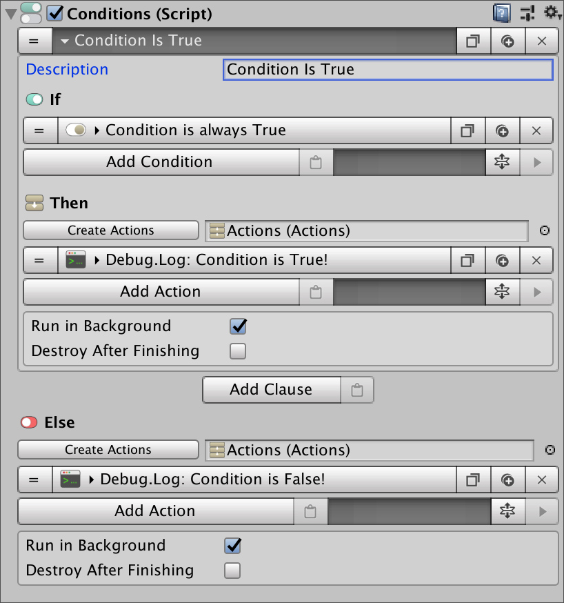
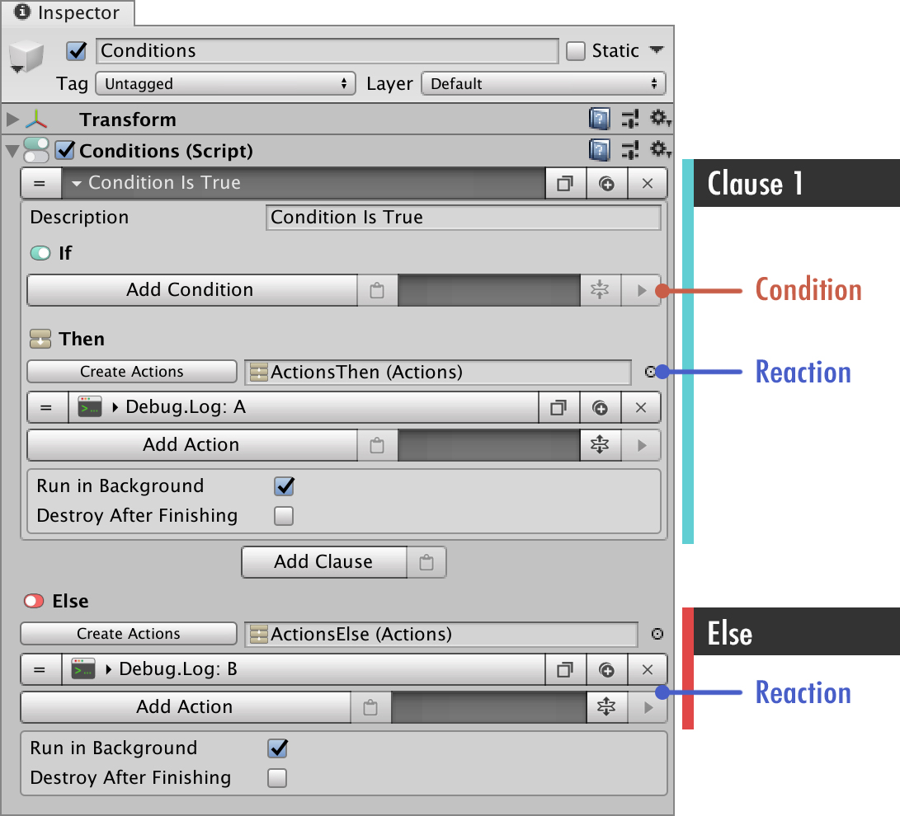

# Events

Events components a little bit more complex than Actions; they allow to check for conditions and branch from execution threads.

Even if the concept seems complicated, it's actually fairly simple: Imagine you have a **Chest** that the player can loot. This **Chest** should only be looted once.

Upon clicking it, if it's the first time, the player gets some items. Otherwise a message can be prompted stating that the chest has already been looted.

## Anatomy of an Event

**Events** work much like [Actions](actions.md), but instead of immediately being executed when called, they perform a set of _checks_ before deciding which action to call \(if any at all\).

An **Event** follows the following process:

* Check the first **Interaction**
  * If all **Conditions** are _true_
  * Then executes its **Actions**
* If not all **Conditions** where _true_, jump to the second **Interaction**
  * If all **Conditions** are _true_
  * Then executes its **Actions**
* ...
* If any of the **Interaction**'s **Conditions** was _true_, then execute a special **Actions**

Only one set of **Actions** will be called in an **Event**. If the first **Interaction**'s **Conditions** are all true, only its **Actions** will be executed and the rest of the **Interactions** won't even be checked.


**Events** are hard to get at the beginning. For a more comprehensive explanation, watch the following tutorial.

{% embed data="{\"url\":\"https://www.youtube.com/watch?v=WbREQsACPjw\",\"type\":\"video\",\"title\":\"\#3 Getting Started with Game Creator - Events\",\"description\":\"Download at: https://www.assetstore.unity3d.com/\#!/content/89443\n\nGame Creator is an ecosystem that gives Unity developers a world class technology platform from which they can build games that work seamlessly across multiple platforms quickly and efficiently.\n\nIn these videos you\'ll learn everything you need to start using Game Creator like a PRO.\",\"icon\":{\"type\":\"icon\",\"url\":\"https://www.youtube.com/yts/img/favicon\_144-vfliLAfaB.png\",\"width\":144,\"height\":144,\"aspectRatio\":1},\"thumbnail\":{\"type\":\"thumbnail\",\"url\":\"https://i.ytimg.com/vi/WbREQsACPjw/maxresdefault.jpg\",\"width\":1280,\"height\":720,\"aspectRatio\":0.5625},\"embed\":{\"type\":\"player\",\"url\":\"https://www.youtube.com/embed/WbREQsACPjw?rel=0&showinfo=0\",\"html\":\"
<iframe src=\\"https://www.youtube.com/embed/WbREQsACPjw?rel=0&amp;showinfo=0\\" style=\\"border: 0; top: 0; left: 0; width: 100%; height: 100%; position: absolute;\\" allowfullscreen scrolling=\\"no\\"></iframe>
\",\"aspectRatio\":1.7778}}" %}


