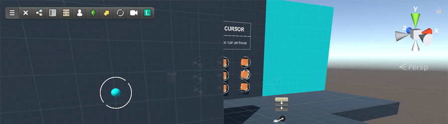

# Game Creator Toolbar

**Game Creator** is all about speed. Instead of right-clicking on the _Hierarchy Panel_, selecting _Game Creator_ and then picking which component you want to create, you can simply select the component from the **Game Creator Toolbar**.

The toolbar is a small utility bar found at the top-left edge of the Scene view. It's dynamically built. This means that when you install a new modules this may stack a new button at the right.


For example, the **Dialogue** module adds a button option to create a dialogue component.


To reveal the Toolbar click on the Unity's top menu and select `Game Creator → Show Toolbar`. Alternatively you can press `⌘ + T`.

You can dismiss the **toolbar** clicking on the `x` button. You can also drag the toolbar around the _Scene view_ by clicking and holding onto the three horizontal bars.

The rest of the buttons correspond to the main Game Creator components.


If you are not familiar with an icon, you can hover the mouse over one and a tooltip will appear with a small explanation of what this button does.


