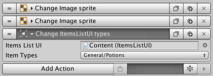
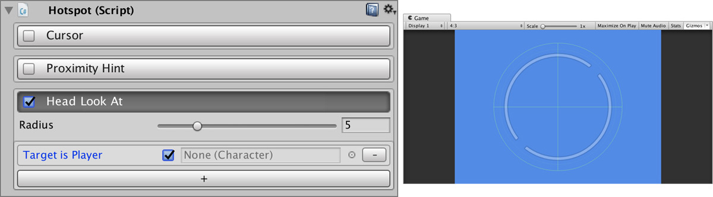

# Game Creator

The heart of **Game Creator** is composed of different components that, used together, allow you to develop any type of game. 

The first three are responsible for interacting with the world and allow developers to visually script the world:

* **Actions:** List of instructions
* **Conditions:** Branch to different Actions depending on certain conditions
* **Triggers:** Respond to events and call Actions and Conditions

Apart from these three core components, there are also:

* **Characters:** Fully animated \(and customizable\) Non-Playable Characters
* **Player:** Same as a Characters but this one is under the control of the user
* **Camera Motors:** A collection of cinematic camera behaviors that can be switched between them.
* **Variables:** Allow you to store world information
* **Hotspots:** Give the player a reaction when passing by these components

For example, a user controls a **Character** \(Player\) which when it steps on a **Trigger**, it executes a set of **Actions** \(which can be a trap where rocks fall and reduce the player's Health\)

## Actions

A set of instructions that are sequentially executed from top to bottom. For example, an Actions set could be the following one:

* Move **Player** near object **Chest**
* Play animation `Open` on object **Chest**
* Give `10 gold coins` to **Player**

Example of an Action component:

Click [here](actions.md) to learn more about them.

## Conditions

Condition the execution of **Actions**. For example, you can check if the object **Chest** has been opened. If so, don't increase the player's `gold coins`, but show the message: `This chest has already been looted!`

Example of a Condition component:

Click [here](conditions.md) to learn more

## Triggers

Triggers react to inputs and can execute one or more **Actions** and **Conditions**. For example, you can detect when the player enters a _Lava Zone_ and execute an **Action** that makes the player take damage.

Click [here](triggers.md) to learn more about Triggers.

## Hotspots

These are very simple components that are usually used together with **Triggers**. They allow to _hint_ the player about interactive elements. These _hints_ can be turned on and off depending on the type of interaction you want.

For example, you can make the **Player** turn his head towards the hotspot to indicate there's something that has caught his/her attention.

Click [here](hotspots.md) to learn more about Hotspots.

## Characters

As its name implies, **Characters** allow to easily add non-playable characters to your world using one single click.

All Characters have **walk**, **run** and **jump** capabilities by default. They also have procedural feet placement using **Inverse Kinematics.**

**Character** 3D models can also be easily changed y dropping your 3D model onto the "_Change Model_" field. Game Creator will automagically retarget all the bones to match the ones from the animations.

There's a special type of **Character** called **Player** which inherits all the Character's functionalities and also allows it to be directly controlled by the user using different control schemes.

Click [here](characters/) for more information.

## Camera Motors

Cameras control how the world is viewed by the player. There are different types of cameras at your disposal such as steady cameras, top-down cameras motors, orbital adventure cameras, dolly cameras, tween cameras, and much much more!

For more information on Cameras and Camera Motors click [here](camera/).

## Variables

Variables allow you to store and retrieve information from the world. For example, the "_health_" of the player could be set as a variable with an initial value of 10, which decreases in one unit every time the player gets hit.

There are three types of Variables:

* **Global Variables:** These variables have a scope of the entire game and are referenced by a given name.
* **Local Variables:** These variables are attached to Game Objects and are referenced by a given name.
* **List Variables:** These variables are attached to Game Objects and are placed like an array of values, which can be accessed via an index.

For more information on how Variables work, click [here](variables/).

