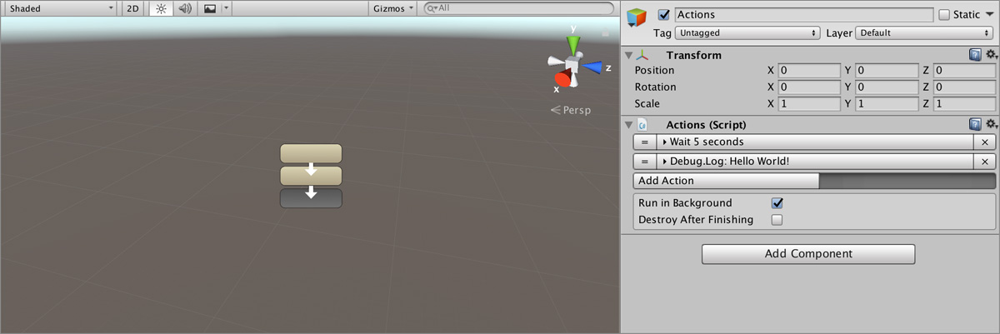
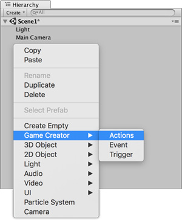
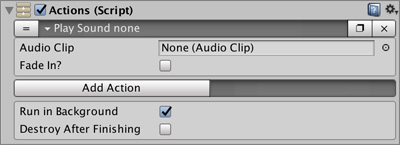
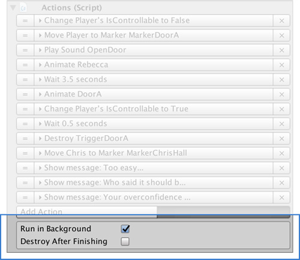

# Actions

**Actions** are one of the core features behind **Game Creator**. They allow to animate characters, activate interruptors, move objects, and a long etcetera.

## Creating an Action

To create an **Action**, right click on the _Hierarchy Panel_ and select `Game Creator → Actions`. Alternatively you can also add the **Actions** component to any **Game Object** or click on the **Actions** button from the [Game Creator Toolbar](../systems/game-creator-toolbar.md).

## Anatomy of an Action

An **Action** is a single instruction that when executed _"does something"_. For example, the action **Wait** puts the execution on hold for a number of seconds.

Here's an example of an action called **Play Sound**.


When an **Action** is executed in runtime it will be highlighted in **light blue**. This is very useful when you want to track which instruction is being executed.


To add a new Action click on the **Add Action** button. A categorized dropdown window will appear. You can navigate using your _mouse_ or the _keyboard_. 

Select which action you want to add and it will automatically be added at the end of the list.

## Behavior Options

You can configure the behavior of an **Action** at the end of the component.

### Run in Background

When the `Run in background` checkbox is marked the **Action** will always be executed when called. If the checkbox is left unmarked, if another **Actions** object is being executed and is set to run in the foreground, the first one won't be executed.


In other words, two **Actions** can't be executed at the same time if they both have the **Run in background** checkbox unmarked.


### Destroy After Finishing

**Game Creator** is all about fast development. If you want to destroy an **Actions** object after all its instructions have been executed, mark this checkbox.


You can accomplish the same behavior using the **Destroy** action at the end of the container of **Actions**., though it's faster this way.



You can add an **Actions** component below a **Trigger** component and let the **Destroy After Finishing** option destroy both the **Actions** and the **Trigger**. Useful if you want to execute it only once, for example, when picking an item.


## Available Actions

**Game Creator** comes with a wide variety of pre-made **Actions** that will help you kickstart your project right away. Here's the complete list of **Actions** that **Game Creator** comes with.


If you find an Action that is not documented here, please send us a message at [hello@catsoft-studios.com](mailto:hello@catsoft-studios.com) and we'll include it.


### Camera

| Action Name | Description |
| :--- | :--- |
| **Adventure Camera Settings** | Change the settings of an Adventure Camera Motor |
| **Change Camera** | Changes the currently active camera motor |
| **Culling Mask** | Changes the Culling Mask of the main camera |
| **Camera Damping** | Changes the smoothness in which the camera follows its target destination |
| **Shake Burst** | Shakes the camera for a limited time |
| **Shake Sustain** | Keeps the camera shaking for an unspecified time |
| **Fixed Camera Settings** | Changes the settings of a Fixed Camera motor |
| **Follow Camera Settings** | Changes the settings of a Follow Camera motor |
| **FPS Camera Settings** | Changes the settings of a FPS Camera motor |
| **Railway Camera Settings** | Changes the settings of a Railway Camera motor |
| **Target Camera Settings** | Changes the settings of a Target Camera motor |

### Character

| Action Name | Description |
| :--- | :--- |
| **Character Attachment** | Attaches a prefab instance to a character bone or removes an attachment |
| **Character Dash** | Make a Character move towards a position. The gradient falloff can be customized as well as its initial velocity |
| **Character Blendshapes** | Animate transitioning a Character's Blend-Shapes. Very useful for creating expressive characters. |
| **Character Mount** | Sets the Character in Mount Mode. In this mode, the character can't be controlled and collisions are ignored |
| **Character Direction** | Changes the direction in which the character looks while idle, walking or running |
| **Character Follow** | Makes a Character follow a target keeping a distance within a min and max radius |
| **Character Gesture** | Plays an animation on a Character once. For more information on Gestures, click [here](characters/gestures.md). |
| **Character Hand** | Makes a Character hand reach for a target using Inverse Kinematics |
| **Inverse Kinematics** | Changes the Inverse Kinematics settings of a Character |
| **Character Jump** | Makes a Character Jump |
| **Character Model** | Changes the 3D model of a Character, retargeting all bones to the new ones |
| **Move Character** | Makes a Character move towards a certain position using the Navigation Mesh, if any. |
| **Change Property** | Change a Character property, such as Height, Is Controllable, Radius, ... |
| **Character Ragdoll** | Changes the _ragdoll_ state of the character |
| **Character State** | Changes or resets the State of a Character. For more information on States click [here](characters/states.md). |
| **Character State Weight** | Change a Character's State weight or influence |
| **Character Stop Gesture** | Forces a Character to stop the Gesture that it is currently being played |
| **Teleport** | Instantaneously moves a Character from its position to a new one |
| **Head Track** | Makes a Character's head look at a target using Inverse Kinematics |
| **Player Movement Input** | Changes the input scheme of the Player |

### Application

| Action Name | Description |
| :--- | :--- |
| **Cursor** | Changes the Cursor image, lock state and visibility |
| **Open URL** | Opens the web browser and a specific webpage |
| **Quality Settings** | Changes the quality settings of the game |
| **Quit Game** | Exits the Application |

### Audio

**Game Creator** comes with an optimized **Audio Manager** that reuses audio sources in a ring-buffer so your game doesn't experience hiccups when playing many sound effects at a time. Audio is divided in 2 categories

* **Music:** Background music set in a loop. You can change it by cross-fading between multiple tracks.
* **Sounds:** Or Sound Effects. These are small sounds that are played only once.

| Action Name | Description |
| :--- | :--- |
| **Pause Audio** | Pauses all audio effects |
| **Play Music** | Plays a music track allowing you to fade it in |
| **Play Sound** | Plays a single sound shot |
| **Play Sound 3D** | Similar to Play Sound but allowing you to specify the source of the sound |
| **Stop Music** | Stops the background music, allowing you to fade it out |
| **Stop Sound** | Force a sound effect currently being played to stop |
| **Change Volume** | Changes the volume of the background music, sound effects or both of them |

### Debug

These **Actions** allow to easily test your game and spot errors. These won't have any impact on your final game build.

| Action Name | Description |
| :--- | :--- |
| **Debug Break** | Pauses the Editor |
| **Debug Message** | Write a text message in the Console, using a Warning, Information or Error flags |
| **Debug Name** | Prints the name of a Game Object through the Console |
| **Debug Variable** | Prints the value of a Variable through the Console |
| **Debug Beep** | Plays a Beep sound effect generated by the OS \(Only works in the Editor\) |

### General

| Action Name | Description |
| :--- | :--- |
| **Execute Actions** | Execute an Actions object and allows you to either continue the execution or wait till these Actions are finished to resume |
| **Cancel Actions** | Cancels the execution of an Actions object |
| **Change Language** | Changes the language of the game. All localized strings will be automatically updated |
| **Comment** | This Action does nothing and only serves to write down a note for the developer |
| **Call Conditions** | Executes a Conditions object, allowing you to continue the execution of wait till the Conditions are finished and resume |
| **Dispatch Event** | Dispatches a named event. More information about Event Dispatchers [here](../systems/event-system.md). |
| **Gravity** | Change the general gravity |
| **Call Methods** | Allows you to call any method from any component as long as it has zero or one parameter |
| **Restart Actions** | Restarts the execution of the current Actions object |
| **Time Scale** | Changes the time scale as well as the fixed time scale. Useful for pausing the game or making a slow-motion effect. |
| **Wait** | Waits some seconds before jumping to the next instruction |
| **Render Reflection Probe** | Manually renders a Reflection Probe. Bear in mind that reflection probes might not be active due to quality settings |

### Object

| Action Name | Description |
| :--- | :--- |
| **Add Component** | Adds a Component to a target |
| **Animate** | Sends a Trigger, Bool, Integer or String parameter to an Animator |
| **Animator Layer** | Changes the Animator Layer properties of a given Animator |
| **Change Material** | Change the Material of a Game Object |
| **Change Texture** | Changes the Texture of a Material. By default it changes the Albedo texture but can also modify any input texture |
| **Change Color** | Changes the Color of a Material |
| **Destroy** | Destroys a target Game Object |
| **Enable Component** | Enables or Disables a game object component |
| **Instantiate** | Creates an instance of a prefab or another game object and places it at a certain position and rotation |
| **Light** | Changes the Light properties of a Game Object |
| **Look At** | Makes a Game Object face at a target. The Z axis will be aligned towards the target |
| **Nearest with Component** | Stores in a variable the nearest \(if any\) Game Object with a certain component within a certain radius |
| **Nearest in LayerMask** | Stores in a variable the nearest \(if any\) Game Object within a certain radius that belongs to a layer mask |
| **Nearest with Tag** | Stores in a variable the nearest \(if any\) Game Object within a certain radius that has a specific tag |
| **Physics** | Apply forces to any Game Object with a Rigidbody |
| **Send Message** | Call a method from any component using the [SendMessage](https://docs.unity3d.com/ScriptReference/GameObject.SendMessage.html) API |
| **Set Active** | Enables or disables a Game Object |
| **Timeline** | Plays a Timeline object |
| **Transform** | Changes the Transform properties of  Game Object, such as the scale, position, rotation and parent |
| **Transform Move** | Smoothly moves an object from A to B at a specified duration |
| **Transform Rotate** | Smoothly rotates an object to match an Euler rotation |
| **Transform Rotate Towards** | Smoothly rotates an object to face a given target |
| **Trigger** | Executes a Trigger object |

### Save & Load

**Game Creator** has a robust built-in save system that keeps track of most important information in order to safely restore the state of a game when loading a previous game.

Each game save is stored in a slot. Each slot is called **Profile** and you can store up to 99 different game saves.

For example, if you save the game at a given point in **`Profile 3`**, you can later on reload the game loading the **`Profile 3`**.

| Action Name | Description |
| :--- | :--- |
| **Current Profile** | Changes the current active profile |
| **Delete Profile** | Deletes a Profile along with all its saved data |
| **Load Game** | Loads the game \(either using the current profile or a specified one\) |
| **Load Last Game** | Loads the last saved game from any profile. Useful when having a "Continue" button in your main menu |
| **Save Game** | Saves the game content at the current profile location or a specified one |

### Scene

| Action Name | Description |
| :--- | :--- |
| **Load Scene** | Loads a scene by name. A scene can be loaded as a single instance or additively. Click [here](https://docs.unity3d.com/ScriptReference/SceneManagement.LoadSceneMode.html) for more information. |
| **Load Scene with Player** | Similar to Load Scene but also allows to make the Player start a a given location. Useful when a scene can be entered from multiple points |
| **Unload Scene Async** | Unloads an additive scene asynchronously and reports complete when the scene is unloaded |

### UI

UI Actions allow Game Creator to interact with UI elements and even create small but useful animations.

| Action Name | Description |
| :--- | :--- |
| **Canvas Group** | Changes the settings of a Canvas Group over time. Useful for fading in and out entire UI Panels. |
| **Change Font Size** | Changes the font size of a Text component |
| **Change Text** | Changes the text of a Text component |
| **Graphic Color** | Changes the tint color of either a Text or an Image |
| **Image Sprite** | Changes the sprite of an Image component |

### Messages

Messages section is a work in progress Actions list that will allow you to display information on screen.

| Action Name | Description |
| :--- | :--- |
| **Simple Message** | Displays a simple message on top of a UI element. Useful for prototyping conversations |
| **Floating Message** | Displays a floating message on top of an object with a certain offset. Useful to display multiple conversations simultaneously |

### Variables

There are mainly three types of **Variables**:

* **Global Variables**
* **Local Variables**
* **List Variables**


When referring to either **Global Variables**, **Local Variables** and **List Variables** we'll use the term "**Variables"** with capital L.


How Game Creator interacts with them is done through the use of the following Actions. For more information about Variables click [here](variables/).

| Action Name | Description |
| :--- | :--- |
| **Add to List Variables** | Adds a new element to a List Variables object |
| **Clear List Variables** | Removes all element from a List Variables |
| **List Variables Loop** | Execute an Action having as Invoker each of the different elements of the List Variables |
| **List Variables Iterator** | Changes the iterator pointer of a List Variables |
| **Remove from List Variables** | Remove an element from a List Variables |
| **List Variables Select** | Picks an element from the List Variables and store it in a Local or Global Variable |
| **Gather Components by Distance** | Fills a List Variable with a collection of objects with a certain component. The list is sorted by their distance to a source |
| **Variable Random** | Generates a random value between min and max and stores it in a Variable |
| **Variable Bool** | Assign a value of _true_ or _false_ to a Variable |
| **Variable Color** | Assign a Color value to a Variable |
| **Variable Game Object** | Assign a Game Object value to a Variable |
| **Variable Number** | Assign a numeric value to a Variable |
| **Variable Sprite** | Assign a Sprite value to a Variable |
| **Variable String**  | Assign a text value to a Variable |
| **Variable Texture2D** | Assign a Texture2D value to a Variable |
| **Variable Vector2** | Assign a Vector2 value to a Variable |
| **Variable Vector3**  | Assign a Vector3 value to a Variable |
| **Variable Reset** | Reverts to the default value of a Variable |
| **Variable Add** | Add a value to a numeric Variable |
| **Variable Divide** | Divides the value of a Variable for a certain value |
| **Variable Math** | Allows to perform a Math operation using a string-based formula |
| **Variable Multiply** | Multiplies the Variable value by another value |
| **Variable Subtract** | Subtracts the Variable value with another one |

