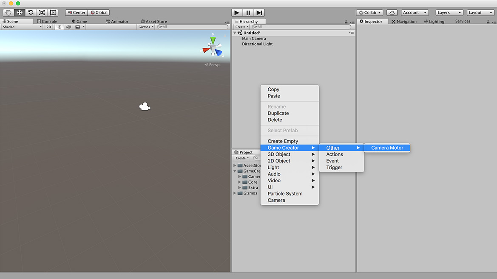

# Camera

In order to know which one is the **main camera** and apply different behaviors to it, **Game Creator** provides a component called **Camera Controller**.

Game Creator has two different Camera types:

* **Camera Controller:** Attached to the main camera. Mimics the behavior of an active Camera Motor.
* **Camera Motors:** There are different types of motors. They tell the Camera Controller where to look.


The first time you create a **Camera Motor**, a **Camera Controller** will be automatically attached to your main camera and linked to the created **Motor**.


## Camera Controller

The **Camera Controller** has a slot with a reference to an active **Camera Motor**. The **Camera Controller** tries to mimic the referenced motor properties.


There should always be only **one single instance** in the entire scene.


The **Camera Controller** also has dampening options in case you constantly switch between different motors and you want to smooth out the different transitions.

## Camera Motors

There are different types of **Camera Motors**. Each one of them is responsible for a specific logic. Some are very simple, like the **Fixed Camera Motor**, which only rotates towards a target. Others, like the **Adventure Camera Motor** allow you orbit around a character while avoiding walls getting in the way.

Click [here](camera-motors.md) for a more in-depth view of the different Camera Motors

To create a Camera Motor right click on the Hierarchy Panel and select `Game Creator → Other → Camera Motor`.


We're constantly looking for new ideas of **Camera Motors**. If you feel we're missing one drop us a line and we'll discuss the viability.


