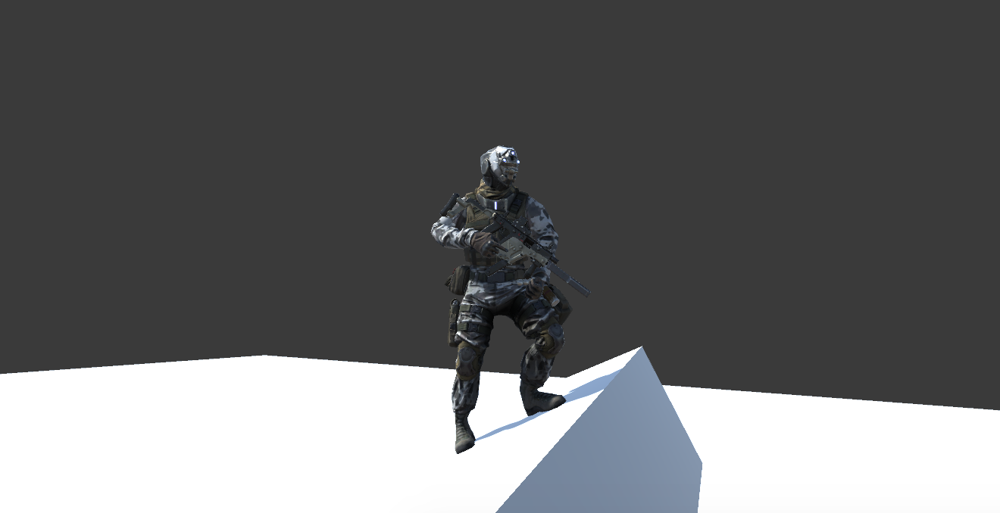
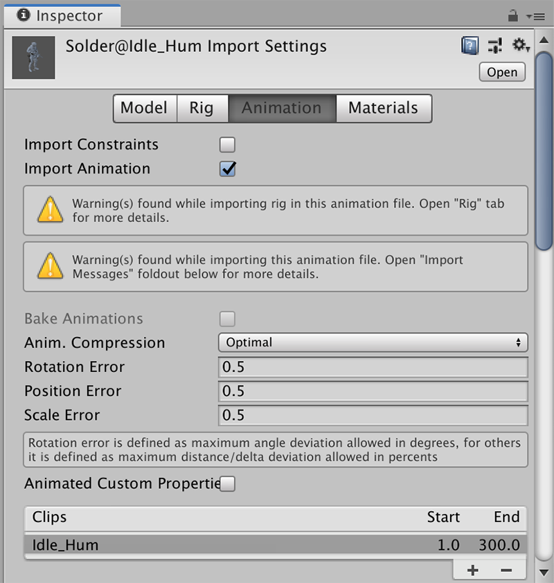
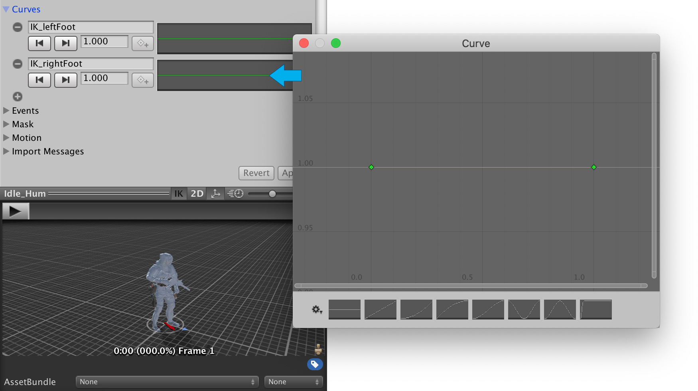
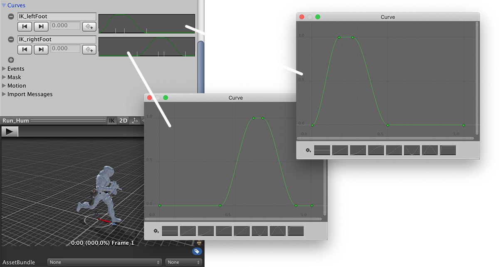

# IK in custom Animations

**Game Creator** makes it very easy to correctly align a **Character**'s feet on uneven terrain. All that you have to do is tell, per animation clip, which frames should **Game Creator** consider being grounded and which not.


For example, for the _**Idle**_ animation, both feet should be considered to be on the ground at all times. However, when _**Running**_, the character right foot elevates while the left one touches the ground, and vice-versa.


This is really easy to set up. All you need to do is select your imported animation clip and bring up the **Animation** tab in the inspector.


We're going to be using the [PBR Solider](https://assetstore.unity.com/packages/3d/characters/humanoids/pbr-soldier-61711?aid=1100l36uR&utm_source=aff) model as an example, which is an asset from the _Asset Store_. But you can replicate these steps with your own custom animations.


Let's see how to configure the Idle animation first. Let's select the animation clip from the Project Panel.

## Idle Animation

We'll ignore those warnings for now and focus on the animation clip. Make sure you select the "Idle\_Hum" clip and scroll further down, up until you see the _Curves_ section.


**Curves** allow you to define custom properties that change over the duration of the animation. This is perfect in our case, since we want to smoothly transition between the states: feet on the ground and feet over the ground.


Click on the \(+\) sign and create a couple of curves. Give each one of them the name **IK\_leftFoot** and **IK\_rightFoot**. It is very important that you name these with the correct capital letters!

Click on the curve graph and edit the values so both ends. By default the value is set to **0** but we need to change it to **1**.


A value of 1 means the foot is in contact with the floor and it should be aligned with its normal value. A value of zero means the foot is in the air and no IK should be applied.


If we click play, we'll see how, on steep terrain, the player correctly aligns its feet with the ground while being on idle. But what happens if we approach the Running animation like the Idle? It will drag their feet on the ground, without elevating them.

## Running/Walking Animation


This is optional, as the player will probably never notice if the feet are correctly aligned when characters walk or run. However, we still provide you with the tools in case you want to do allow it.


So, to solve this, the _**Walking**_ and _**Running**_ animations need a bit more work. We need to synchronize the frames that each feet are touching the ground with the ones that are not.

To do so, we scrub over the timeline and select which frames are the feet in contact with the ground and create a key in the **Curve** graph. For example, the run animation for the _PBR Soldier_ would look something like this.


The best results are obtained from experimenting. We've discovered that precision is not that important. What yields the best results is having smooth gradients.


