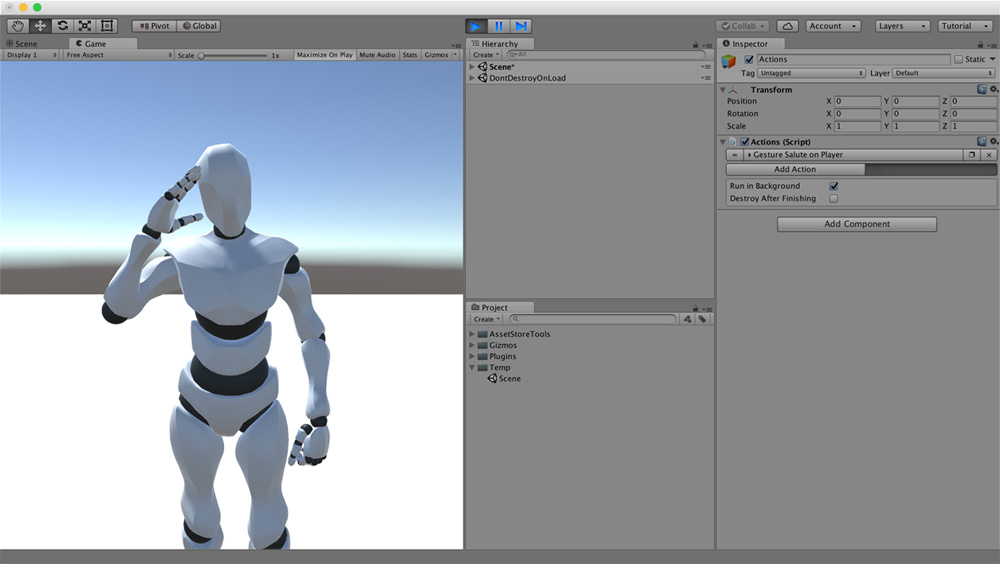

# Gestures

The **Character** with the **Character Animator** can perform multiple gestures. A **Gesture** is a small movement the character does that doesn't imply changing its state. For example, when two people interact, their hands move according to their verbal language to emphasize their communication.


Since version **0.4.1** you can add custom **Gestures** using the new animation system.


To add a custom animation, simply use the **Character Gesture Action** and drag an animation to the `gesture` field.


Notice that you can also use an **Avatar Mask** to mask the animation from some body parts. For example, you can use an **Upper Body** Avatar Mask to play the previous animation so that the **Character** can use the same animation when walking as while running or being idle.


