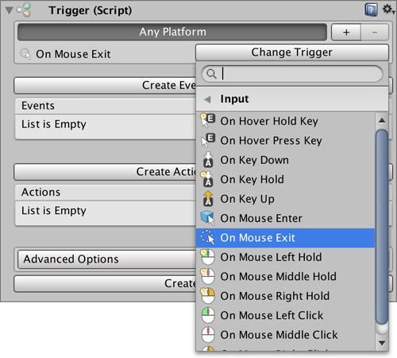

# Triggers

**Triggers** are used to fire **Actions** and **Conditions** when _something_ happens. This _something_ can range from the player pressing a certain key to an NPC's entering a certain area.


Triggers are executed from **top** to **bottom**.


## Advanced Options

The white cog at the top right of the component there's an **Advanced Options** foldout. You can specify a minimum distance from which the **Player** has to be for this trigger to be activated. 


This is specially useful when dealing with pickup items or interactive doors.


There's also a shortcut option to create a [Hotspot](hotspots.md) component from within the **Trigger**.

## Tips

Some times you'll want a **Trigger** to execute an **Action** only once. You can easily take advantage of an **Action's** `DestroyAfterFinishing` property to destroy both the **Action** and the **Trigger**.

To do so, simply add an **Actions** component inside the same **Game Object** where the **Trigger** is. After executing the **Actions**, it will destroy the entire **Game Object**.

## Available Triggers

These are all the **Triggers** that come with **Game Creator**. You can download more at the [Game Creator Hub](https://hub.gamecreator.io), creating your own using our [Open API](../systems/game-creator-api/custom-triggers.md) as well as find more inside each of the modules.

### Input

| Trigger Name | Description |
| :--- | :--- |
| **On Cursor Raycast** | When the cursor is locked at the center of the screen, use this Trigger to throw a raycast from the center of the screen to simulate a click |
| **On Hover Hold Key** | Detects when the mouse is over the Trigger's Collider and the user holds a key for a certain amount of time |
| **On Hover Press Key** | Detects when the mouse is over the Trigger's Collider and the user presses a key |
| **On Key Down** | Detects when the user presses a key down |
| **On Key Hold** | Detects when the user presses a key down and holds it for a certain amount of time |
| **On Key Up** | Detects when the user releases a key |
| **On Mouse Down** | Detects when the user presses a mouse button down |
| **On Mouse Enter** | Detects when the mouse hovers over the Trigger's Collider |
| **On Mouse Exit** | Detects when the mouse exits hovering the Trigger's Collider |
| **On Mouse Left Hold** | Detects when the mouse left button is being pressed for a certain amount of time |
| **On Mouse Middle Hold** | Detects when the mouse middle button is being pressed for a certain amount of time |
| **On Mouse Right Hold** | Detects when the mouse right button is being pressed for a certain amount of time |
| **On Mouse Left Click** | Detects when the mouse left clicks on the Trigger's Collider |
| **On Mouse Middle Click** | Detects when the mouse middle clicks on the Trigger's Collider |
| **On Mouse Right Click** | Detects when the mouse right clicks on the Trigger's Collider |
| **On Mouse Up** | Detects when a mouse button is released |
| **Raycast Mouse World Position** | Detects when the mouse has clicked the Trigger's Collider and stores the point in a Variable |

### Character

| Trigger Name | Description |
| :--- | :--- |
| **On Step** | Detects when a Character makes a step \(right foot, left foot or any of them\) |
| **On Jump** | Detects when a Character jumps |
| **On Land** | Detects when a Character lands |

### Object

| Trigger Name | Description |
| :--- | :--- |
| **On Collision Enter** | Detects when an object touches the Trigger's Collider area |
| **On Collision Exit** | Detects when an object exits the Trigger's Collider area |
| **On Player Enter** | Detects when the Player enters the Trigger's Collider area |
| **On Player Enter Key** | Detects when the user presses a key and the Player is within the Trigger's Collider area |
| **On Player Exit** | Detects when the Player exits the Trigger's Collider area |
| **On Player Stay Timeout** | Detects when the Player has been at least some seconds inside the Trigger's Collider area |
| **On Trigger Enter** | Detects when an object enters the Trigger's Collider area and has the isTrigger flag set as true |
| **On Tag Enter** | Detects when an object with a certain tag enters the Trigger's Collider area |
| **On Trigger Exit** | Detects when an object exits the Trigger's Collider area and has the isTrigger flag set to true |
| **On Tag Exit** | Detects when an object with a certain tag exits the Trigger's Collider area |
| **On Trigger Stay Timeout** | Detects when an object has been at least a few seconds inside the Trigger's Collider area |

### Variables

| Trigger Name | Description |
| :--- | :--- |
| **On Variable Change** | Detects when a Global, Local or List Variable changes its value/s |

### User Interface

| Trigger Name | Description |
| :--- | :--- |
| **On Mouse Enter UI** | Detects when the mouse hovers a UI element |
| On Mouse Exit UI | Detects when the mouse exits hovering a UI element |

### **General**

| **Trigger Name** | Description |
| :--- | :--- |
| **On Event Receive** | Detects when a certain Dispatched Event is received. For more information on the Event System click [here](../systems/event-system.md) |
| **On Invoke** | Detects when a Trigger is manually invoked |
| **On Disable** | Detects when the Trigger Game Object is disabled |
| **On Enable** | Detects when the Trigger Game Object is enabled |
| **On Load** | Detects when a game is loaded from a save file |
| **On Save** | Detects when a game is saved |
| **On Start** | Detects when the Trigger Game Object is initialized |

