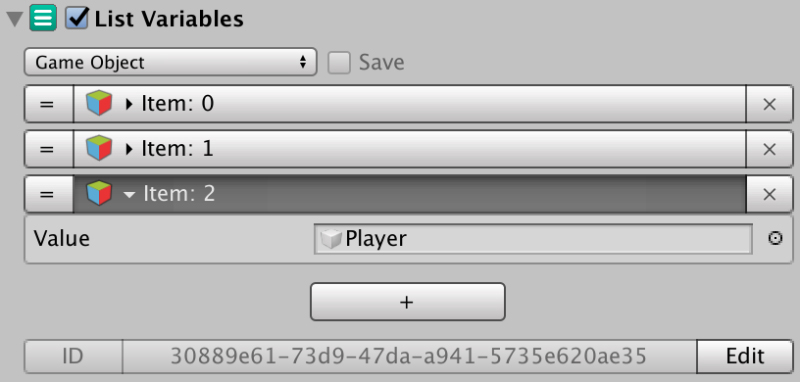
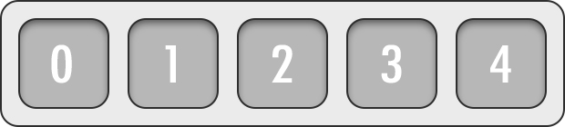

# List Variables

**List Variables** are similar to [Local Variables](local-variables.md) in that their scope is limited to the scene they are at. Instead of accessing the Variables by name, you can access them by **index**.

Items can be inserted and removed at any position. They are very useful when you want to stack a bunch of game objects \(or any supported data\) and do something with them, without having to worry about how many elements you have stored.


For example, you can have a SIM game where your village has multiple characters doing chores around the town. 

Each of these villagers could be assigned a position inside a List Variable called **`"citizens"`**. 

This List Variable could be used to query information such as getting the citizen that is nearest to the forest and start collecting wood, and giving birth to new citizens would be as easy as adding a new Game Object at the end of the **`"citizens"`** **List Variable**.


## Managing List Variables

There are multiple ways of accessing and storing data in **List Variables** and it's a bit more abstract than with **Global** or **Local Variables**.

### Accessing List Variables

A **List Variables** can be visualized as a list of items placed one after the other. Each element can be accessed via its index value, starting from 0 and increasing in one unit for each subsequent element.

**Game Creator** allows accessing the contents of a **List Variable** through the use of the following shortcuts:

#### Index

Accesses an element via its index. If the index is negative or overshoots the number of elements in the list, it will return null.

#### First

Accesses the first element in the **List Variables**. If there are no elements, it will return null.

#### Last

Accesses the last element of the **List Variables**. If there are no elements, it will return null.

#### Random

Accesses a random element of the **List Variables**. If there are no elements, it will return null.

#### Current

Accesses the current value of the **iterator**, or null if there are no elements. More information about the **Iterator** [here](list-variables.md#the-iterator).

#### Previous

Accesses the previous value of the **iterator**. If the iterator is the first element, the previous element will be the last one. if there are no elements, it will return null.

#### Next

Accesses the next value of the **iterator**. If the iterator is the last element, the next value will return the first element. If there are no values, it will return null.

### Storing data in List Variables

Storing information in **List Variables** work very similarly as accessing its content. The only difference is that there's a value that is going to be added.

## The Iterator

The **iterator** is an advanced feature of **List Variables**. It's an internal index that is updated every time the **List Variable** is accessed or modified.


By default the **iterator** points at the first element. If an **Action** accesses, let's say, index 4, the iterator will be updated and point towards the 4th element.


So it basically remembers the last accessed or modified element. This is very useful when iterating over elements. You can access the **First** element and subsequently ask for the **Next** element, allowing you to iterate all elements of the **List Variable**.

## Advanced

If you are a programmer and want to access the List Variables API, check out the [scripting guide documentation](../../systems/game-creator-api/variables-access.md).

