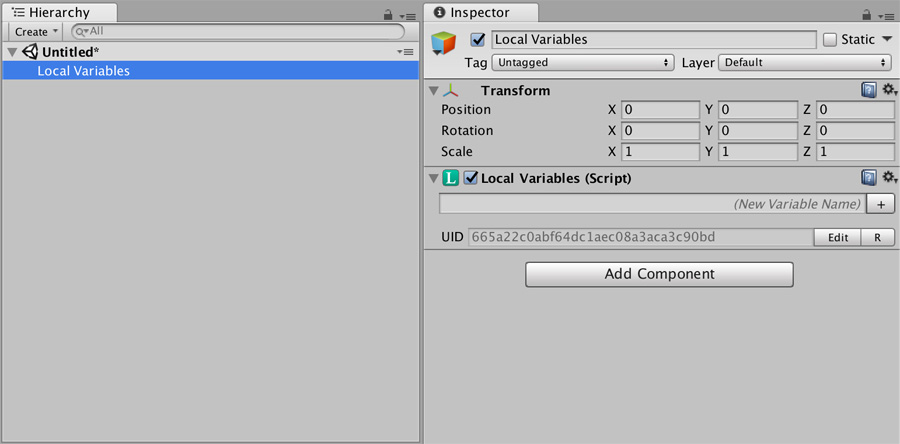

# Local Variables

**Local Variables** are one of the most useful **Game Creator** tools. They allow to access different variable instances from different game objects but with the same name.

For example, let's say you want to give each character of your game a unique name. You can create a **Local Variables** component on each one of them and create a local variable called `name`.

When accessing it, each character will return its own unique name.


**Local Variables** work pretty much like **Global Variables**. The difference is that they live inside the scope of a game object, not project wide.


## Creating and Editing

To create a local variable you can add the `Local Variables` component to any game object. Alternatively you can create one using the **Game Creator Toolbar** option to create a new instance.



Notice there's a UID field at the end of the component. This `UID` is used by the save-system to keep track of the different variables between play sessions.

Every time you create a `Local Variable`, a unique `UID` is generated. You have to bear in mind though that when duplicating a `Local Variable`, this value will stay the same and two `Local Variables` will exists with the same `UID`. In that case, click on the `R` button to generate a new unique button.


It is specially important that you don't modify the **UID** after releasing your game. Doing so will reset the player's game progress.



You can also modify the UID value with a more descriptive one, as long as they are unique.


### Nested Access

Since version **0.9.7** you can access nested **Game Object** variables. For example, if a **Local Variable A** has a reference to another **Game Object B** that also contains a **Local Variable**, you can access the **Local Variable B** by adding a "slash" character between the names of both variables.

* **Game Object 1** has Local Variable "myVariableA" with **Game Object 2** as its value
* **Game Object 2** has Local Variable "myVariableB" with an arbitrary value

```text
myVariableA/myVariableB
```

Accessing via the above name will return the value of the second **Local Variable**.

## Saving Variables

Just like Global Variables, Local Variables have a little checkbox next to its name field. Marking it will tell Game Creator that this variable value must be tracked between play sessions.


**Prefabs** can't save the value of any type of variable because there can be any number of prefab instances in a scene at any given point.


