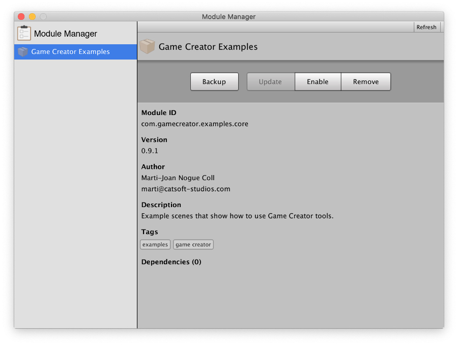

# Module Manager

## What is the Module Manager

**Game Creator** is a large ecosystem of different parts brought together. Instead of shipping **Game Creator** as a single tool with lots of functionalities, it's split into what is called **Modules**.

A **Module** extends or adds new functionalities to the core tools. Their complexity can range from a simple new **Action** to a complete RPG toolbox with stats, buffs and animations.


All modules are available for free at [store.gamecreator.io](https://store.gamecreator.io/)​


## How to use Module Manager

### Import a Module

To add or import a module:

* If you download it from the [Unity Asset Store](https://docs.gamecreator.io/documentation/module-manager) skip to **Managing Modules**
* If you download it from our [store.gamecreator.io](https://store.gamecreator.io/), double click the `.unitypackage` file.

### Managing modules

Once you've imported a **Module**, you can enable, disable or remove it. You can also create a backup copy of an enabled module if you don't use `git` or any repository management tool.

#### Backup

You can create a backup file from the select active **Module** at any time. Backups are located at the root of the project, inside a folder called `Backups/[backup-date]/`. The name of the file is the **id** of the module followed by its **version** number.

#### Enable

Enabling a **Module** allows you to work with the content of the module. In some cases, a **Module** might override some of your data \(such as **Variables**\). This happens mostly when using example modules that teach you how to use a certain tool \(**Dialogue Examples**, **Game Creator Examples**, ...\). If that's the case, a dialog box will prompt warning you of the consequences of enabling the module.


Before enabling or disabling a **Module** it's a advised to make a backup of your project.


#### Disable

Disabling a **Module** will remove all functionalities and scripts from your project, but as long as the installer is still present in your project, you can re-enable it at any time.


Upon disabling a **Module** all data generated by this module will be removed. We recommend  making a backup before disabling it. It's just one click away. 

For example, the **Inventory** module will remove all generated **Items** and **Recipes** from the project when disabling it.


#### Remove

When a **Module** is disabled, you'll have the option of deleting its _installer_. This is perfectly safe and will allow you to free some space from your project. Once a **Module** is removed, it will no longer appear in your **Module Manager** and you'll have to import it again to enable it.

## Available Modules

### Inventory

Manage, trade, use and craft items. Includes a couple of inventory skins.

### Dialogue

Show a cinematic conversation between characters, branch and join different lines back together.



