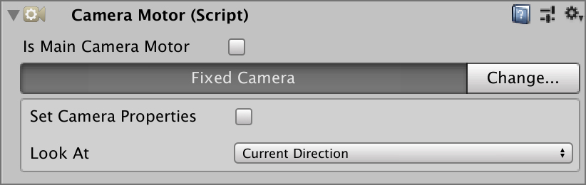

# Camera Motors

**Camera Motors** tell the **Camera Controller** where and how to look at the world. There are a bunch of different types of motors.

## Fixed Camera Motor {#fixed-camera-motor}

This is the simplest type of **Camera Motor**. It stays at a fixed position, just like a _surveillance security camera_ and it can rotate to look at different types of targets.

* **Default**: Doesn't rotate
* **Player**: Looks at the player
* **Target**: Looks at a specific target
* **Position**: Looks at a specific world-space position

## Follow Camera Motor {#follow-camera-motor}

The **Follow Camera Motor** is similar to the **Fixed Motor** as it allows to look at a specific target/position/player but it also allows to follow it.


This type of camera is usually used for **RTS** or **Top-Down** games.



Add a little dampening to the **Camera Controller **to avoid jittering.


## Target Camera Motor {#target-camera-motor}

The **Target Camera** behaves much similar like the **Follow Camera** but also accepts a **Look At** target. It's mostly used for _Shoulder_ cameras where the camera is anchored to a position \(Player's shoulder\) but the focus of the camera is targeting another scene object.


This camera can also be used to highlight a place of interest


## Railway Camera Motor {#railway-camera-motor}

The **Railway Camera Motor** is a little bit more sophisticated type of motor. It allows the camera to follow the target along a path \(or rail\) but never exceed it.

Railway Cameras are a bit difficult to understand at first but are a powerful tool to create cinematic experiences.

