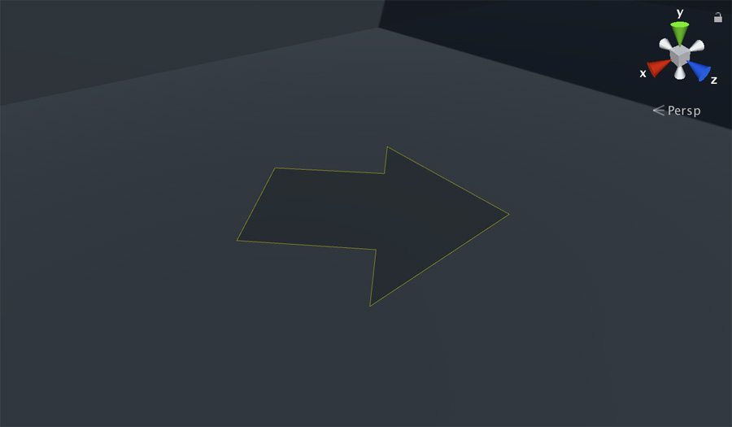

# Markers

**Markers** are special game objects used to set as destinations for moving characters. These **Markers** that are represented with a big yellow arrow.

To create a **Marker** go to the **Hierarchy Panel **and select `GameCreator → Navigation → Marker`. Drag it to the place you want and rotate it.


Setting a **Marker** as a destination will cause the character not only to move towards it but also face the direction the **Marker** is looking at.



Since version **0.4.1** you can also change the color of a specific **Trigger** arrow. By doing so, you can create a color-code to visually identify which one does what.


