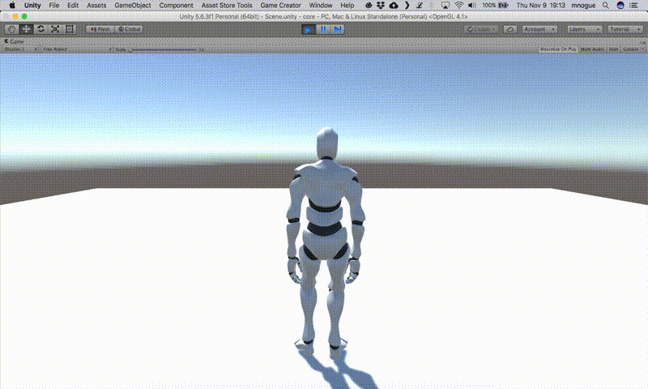

# States

Apart from performing different **Gestures**, a **Character** can also be in different **States**. The difference between a **State** and a **Gesture** is that a **State** is part of a range of Locomotion animations.

For example, you can make the **Player** enter the **Crouch** state when detecting if guards are nearby so sneak past behind them, or move around looking **Drunk**.


States are not **boolean** \(on/off\) values. You can blend between the root locomotion and a state setting the _amount_ value between **0.0** and **1.0**. 

This is very useful if you want, for instance, to set the **Player** normal-injured state based on its remaining health.


