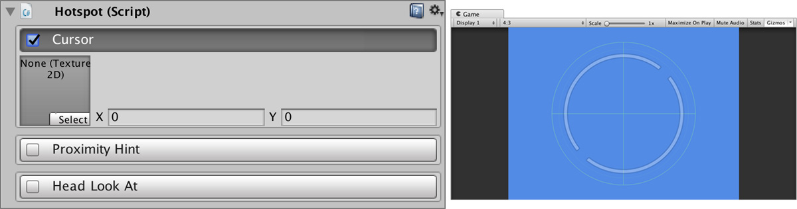
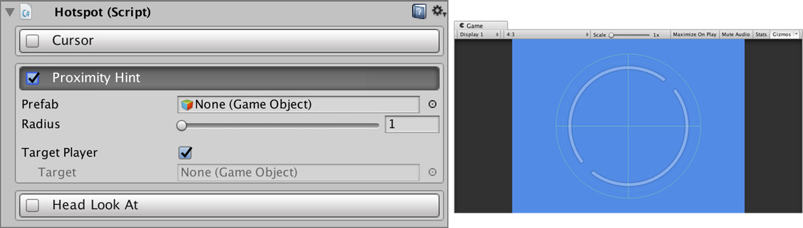
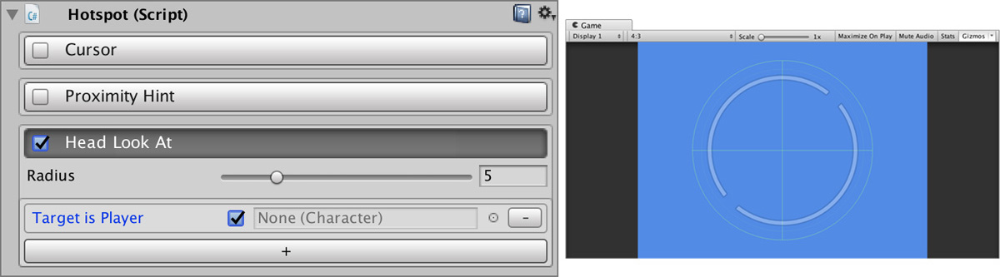
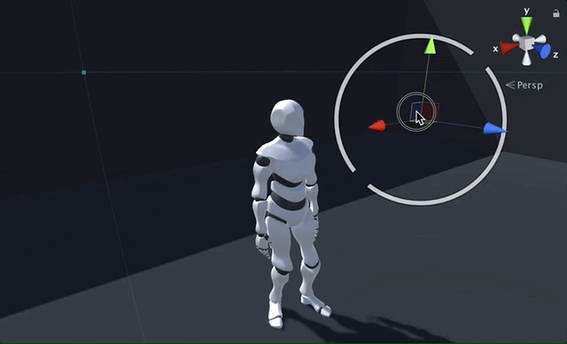

# Hotspots

**Hotspots** are interactive elements that provide a simple interface for common gameplay mechanics that are not part of the core of the game. 

For example, a typical hotspot is next to a **Trigger** with the option to change the cursor texture when the mouse hovers the object.


A **Hotspot** has different options that can be enabled/disabled individually.


## Creating a Hotspot

To create a **Hotspot** component simply **Right Click** on the _Hierarchy Panel_ and select `Game Creator → Other → Hotspot`. You can also create a **Hotspot** element adding the component to any Game Object.

## Hotspot options {#hotspot-options}

A **Hotspot** component has different options that can be enabled.

### Cursor option

Whenever the mouse cursor hovers the **Hotspot**'s collider, the cursor texture will switch to the specified. You can also tell Unity the position of the click point inside the texture \(in pixel units\).

### Proximity Hint option

Sometimes you want to hint the user \(with a glow for example\) there's an important object when the player is nearby.

An instance of the **Prefab** game object will be created once and **enabled**/**disabled** whenever the player enters or exits the area specified by the radius.

### Head Look At option

If you have a _humanoid_ character as a player you can make him **look at** the **Hotspot**. This is a subtle effect but a great way to indicate important objects without the need of using UI elements.

