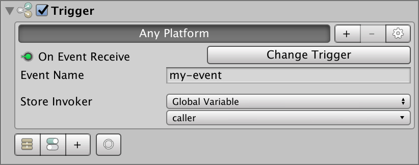

# Event System

Since version 0.9.1 **Game Creator** comes with a fully fledge **Event System** that is built on top of **Triggers** and **Actions** for maximum flexibility.

## Event System 101

When a game object \(yellow\) wants to communicate a state change to other game objects \(blue ones\) it normally has to iterate over all these objects and notify them one by one about the change.

This is okay for small scale and non-dynamic systems, but it can quickly become a mess. An **Event System** flips the system upside down, making objects _subscribe_ to a proxy that observes the object with the state change, and communicates it when the change happens.

By doing so we translate the responsibility of keeping a list of objects that need to be notified from the yellow object to each individual blue object.

## Dispatch an Event

To dispatch an **Event** all that is needed is to call the **Dispatch Event Action**. This **Action** needs a string field which is the **name** of the event.


The name of the **Event** dispatched can be whatever the developer wants.


## Receive an Event

An object can listen to events dispatched using the **On Receive Event Trigger**. This **Trigger** will be called every time an event with a specific name is raised.

Optionally, the invoker of this event can be saved in a **Variable** to lately reference the caller from within an **Action** or a **Condition**.

