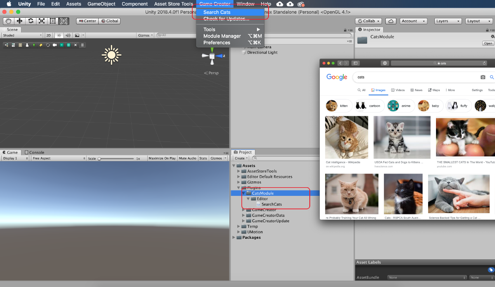
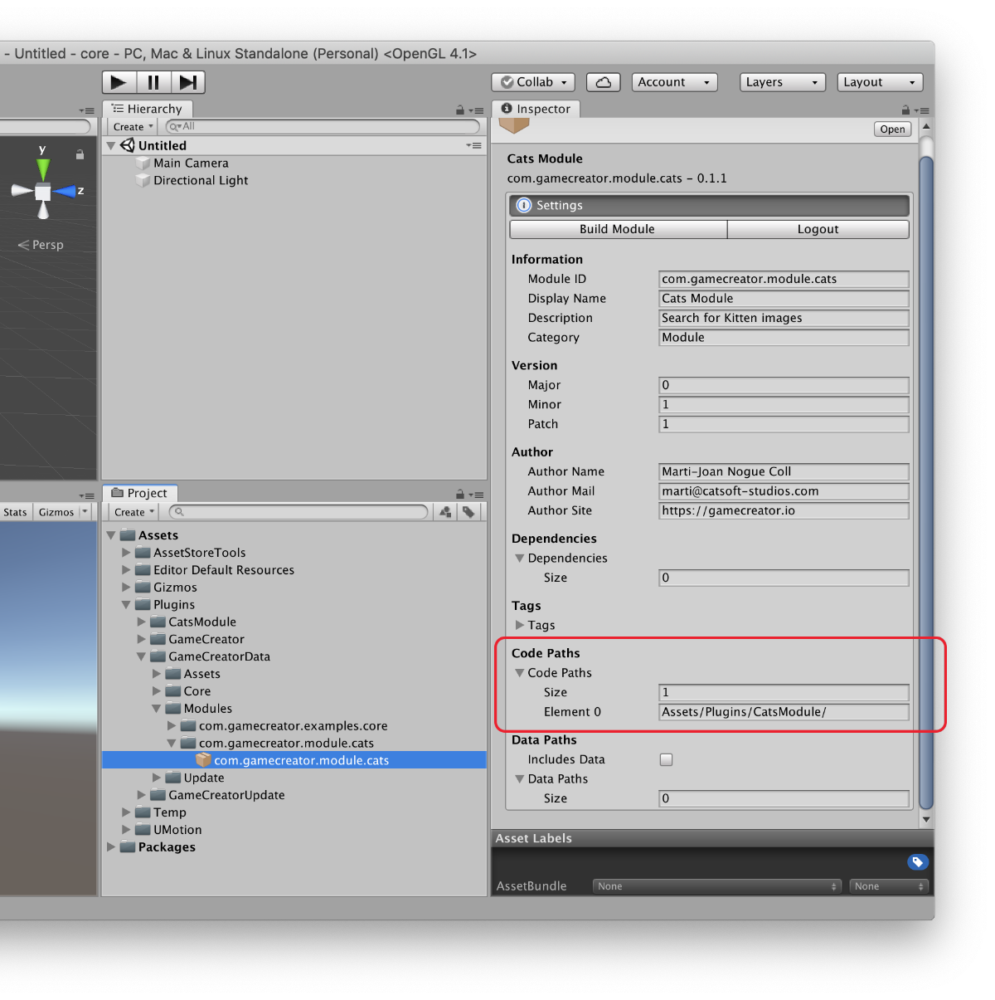
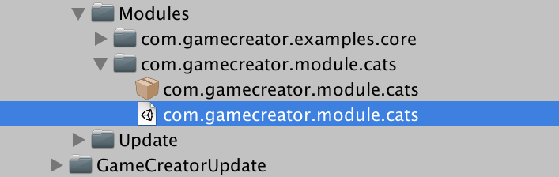
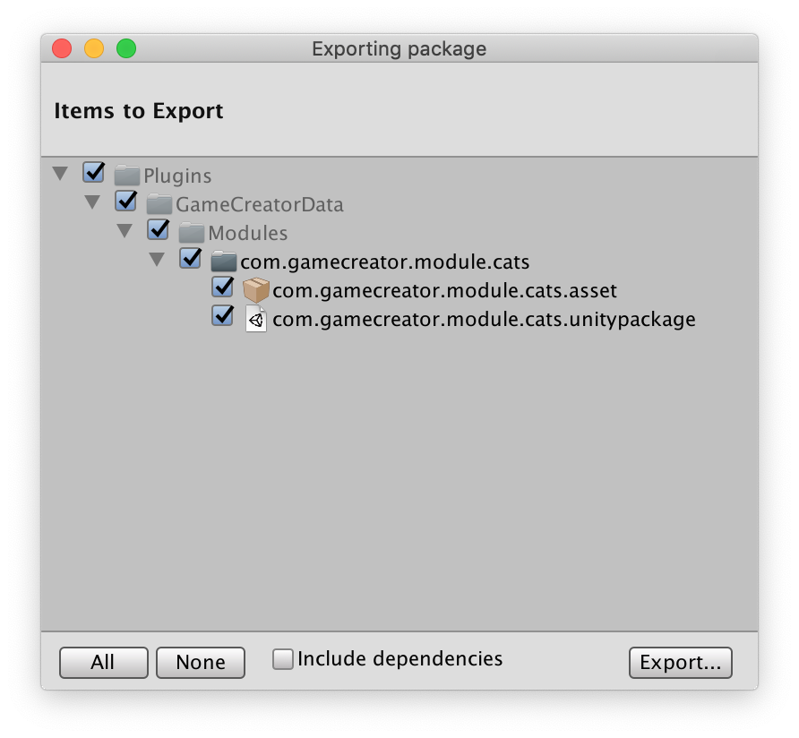

# Custom Module

**Game Creator** comes with a dependency manager called **Module Manager**. It allows to add, remove and seamlessly update extensions that add new features to our core product.


Learn more about the Module Manager [here](../module-manager.md).


All Modules are located at `Plugins/GameCreatorData/Modules/`. Modules are identified by a **unique name** or **bundleID**. You can name bundles however you want, but we recommend following the pattern:

```text
com.[company].[product-type].[product-name]
```

For example, the **bundleID** of the **Dialogue** module is `com.gamecreator.module.dialogue`. By using convention it's easier to avoid duplicate names. 

## Anatomy of a Module

A module is composed of two files. The **Unity Package** and the **Manifest** file.

The **Unity Package** contains all the assets and scripts of the module. It also knows where the files should be routed when updating or installing the module.


If you are unfamiliar with [package managers](https://en.wikipedia.org/wiki/Package_manager), imagine the **Unity Package** is a **zip** file you can decompress to access its content.


The Manifest file contains the rest of the information relative to the specific module. Manifest files are password protected so that inexperienced users don't accidentally mess with them.


The password of all Manifest files is **gamecreator** \(lowercase and without any spaces\).



After signing in the Manifest file you'll see all the Manifest options.


The Manifest can be broken down into 3 sections.

* The **Build Module** and **Logout** options.
* The **General Information**.
* The **Build Settings**.

### Build Module

The **Build Module** button allows you to pack the module into a `bundleid.unitypackage` file which can be found next to the **Manifest**.


The **Build Module** option will overwrite any existing Unity Package at that location.


The **Logout** option allows you to exit the Manifest editing mode.

### General Information

The General information includes the **Information**, **Version**, **Author**, **Dependencies** and **Tags** information.

#### Information

Here you can modify the **name**, **description** and **bundle id** and more. You can freely alter any of these fields \(but bundle-id\) without any further consequences.

#### Version

The version system is an incremental number. We follow the [Semantic Versioning 2.0 standard](https://semver.org/). This means that version are composed of three fields: **X.Y.Z** where

* **X** - Major version. Complete overhaul of major systems.
* **Y** - Minor version. New features are added. Might need to take some config steps when upgrading.
* **Z** - Patch version. Does not contain new features. Fixes errors from the last minor version.


On top of this, stable versions always start at **1.0.0**. A **major** version of **0** means that product is in **Beta** or **Alpha** phase and should not be used in production.


#### Author

Information about the creator of this module. Used for support inquiries.

#### Dependencies

Here you can list what modules are required to be installed before this module. You can also specify the minimum compatible version.


Unless the **minimum dependency** requirements are met, a module won't be neither **installable** nor **updatable**.


#### Tags

Tags allow the module to be easily searched.

### Build Settings

The **Build Settings** are the most important part of the **Module Manifest**. They tell which parts are included in the package and which aren't.

Since version 0.5.1 **Game Creator** assets are split in two: The **Logic** and the **Data**.

The **Logic** includes scripts and all the assets that must be shipped with **Game Creator** in order to work. A module must always include at least one asset \(either a script, a 3D model, ...\).

The **Data** is usually auto-generated information, such as script instances. **Data** is usually excluded from the build as it would overwrite other user's existing data.


**Data** is usually used when building an _example_ module, which needs previously auto-generated data.


In **Game Creator** we publish all the **Logic** at `Assets/Plugins/GameCreator` directory and the **Data** inside `Assets/Plugins/GameCreatorData`.

## Example

Let's see how to create a fictional module and distribute it. But before we begin, let's see what our package does.



Our module is called CatModule and places a button at the top toolbar that allows you to take a break from work and relax watching some kitten's images.

The code is placed inside the Plugins/CatModule folder.

To distribute this module we'll need to create a manifest file at the installation path and fill its information so it knows what's going to be included in the module. The installation path can be found at **`Plugins/GameCreatorData/Modules/`**

Let's create a new folder and call it **`com.gamecreator.module.cats`**. This is called Bundle ID \(or module ID\) and is used to uniquely identify this module across others.

We'll also create a Package file and name it with the same bundle id, like in the following screenshot.



Fill in the information from above. Pay special attention to the Code Paths property. We want to add the paths from where our module will be built from. Since our Cat Module is under **`Plugins/CatModule`** we use the path **`Assets/Plugins/CatModule/`** as the source of the module from where it will be built.


The **Code Paths** needs to start with the **`Assets/`** folder


Now that our package knows where to build the module from, let's click on "Build Module" and wait for some seconds. We'll see that a new file has appeared below our manifest with the same name. This is like a .zip that contains everything inside the Code Paths folder/s.



That's it! If you want to share this module with other users, right click on the **`com.gamecreator.module.cats`** folder and select Export Package. Make sure to **untick** the _Select Dependencies_ checkbox.



Click on **Export...** and you'll be prompted to select a folder where to export the module. Installing this package on any **Unity** project with **Game Creator** will allow the user to enable it using the **Module Manager**.


Download the Cats Module at the [Game Creator Hub](https://hub.gamecreator.io/content/item/gTG2VJna01L62qPW9MBZ).


