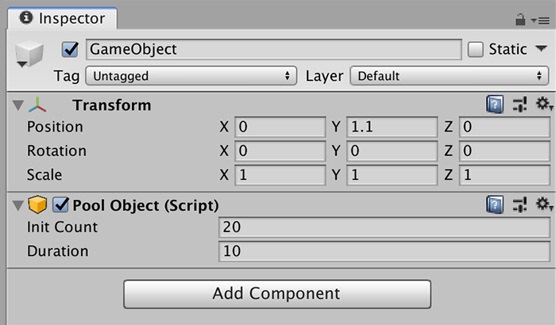

# Pool System

**Pooling** is a common technique used to increase performance on games that create and destroy an object multiple times in a short period of time.


A common pooling system case is with bullets. A machine gun might shoot 30 bullets per second, which can impact performance, since Unity will have to create and destroy 30 prefabs per second.

To solve this, you can create a **Pool** of bullets \(let's say 100\) and deactivate all of them. When the machine gun starts shooting, **Game Creator** will pick a deactivated from the pool and use it for the shooting. Once the bullet hits the target, it's deactivated and returned to the pool to later be reused again.


**Pooling** in **Game Creator** is very easy. You just need to use the "**Instantiate from Pool**" Action and it will automatically generate a bunch of objects when the first instance is spawned.


By default **Game Creator** creates a pool of 20 instances that live up to 10 seconds. You can easily tweak these values adding a "Pool Object" component to your prefab and modifying its parameters.


If a **Pool** of a certain object runs out of available objects it will create new instances, increasing the size of the pool.

