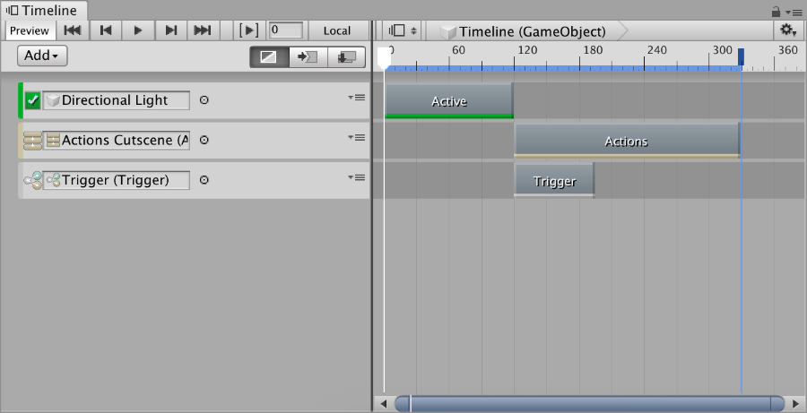

# Timeline

**Game Creator** comes with 3 custom **Tracks** for [Unity Timeline](https://docs.unity3d.com/Manual/TimelineSection.html) that help build in-game cutscenes.

* **Actions** Track
* **Conditions** Track
* **Triggers** Track


Note that **Game Creator** **Tracks** will only work in play-mode. Scrubbing the **Timeline** in Editor-mode will have no effect on **Game Creator** **Tracks**.


