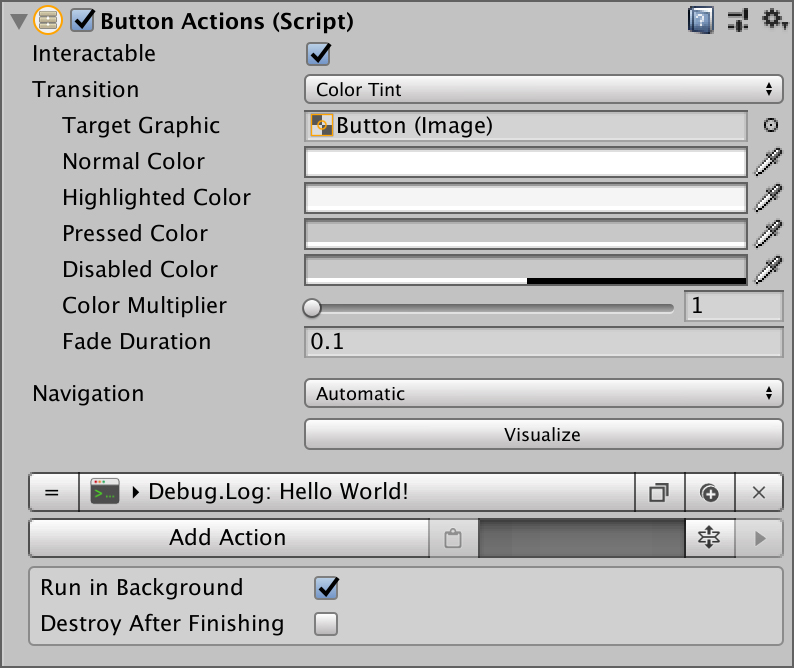
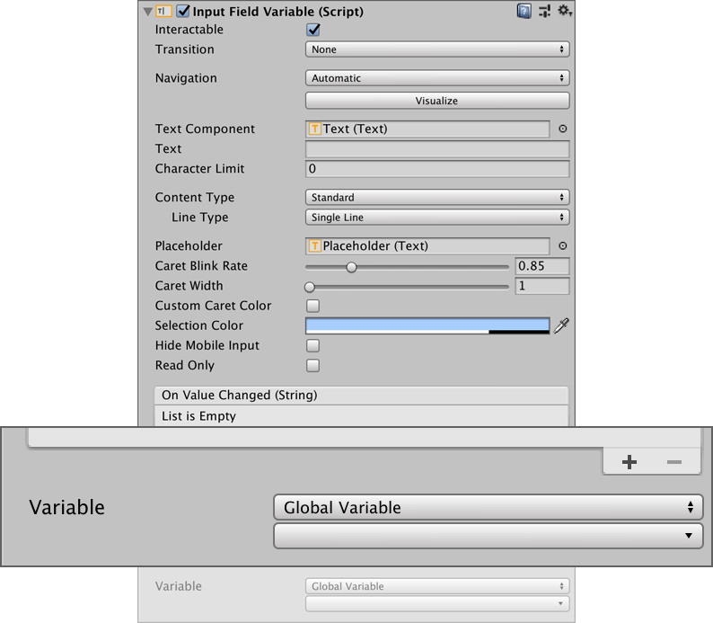
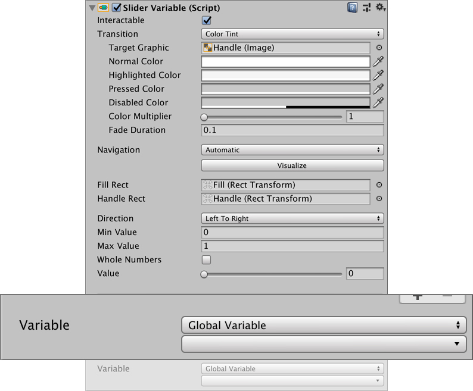
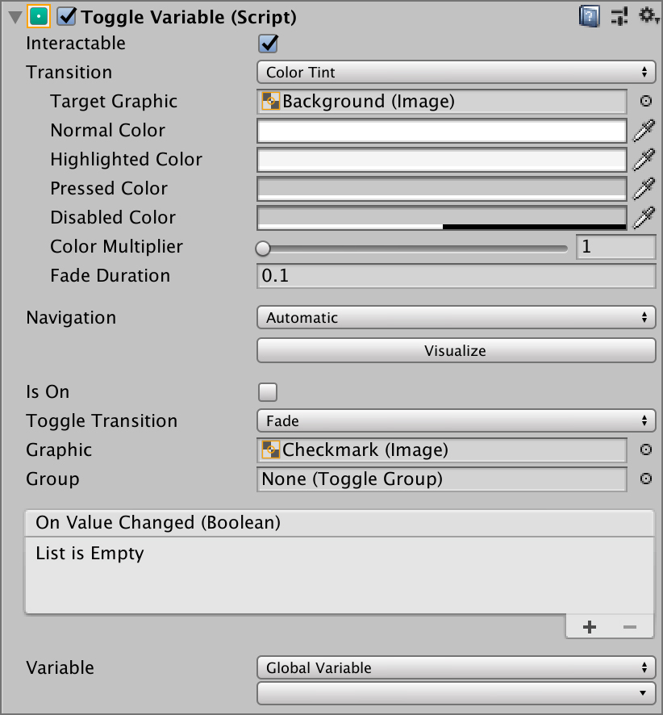
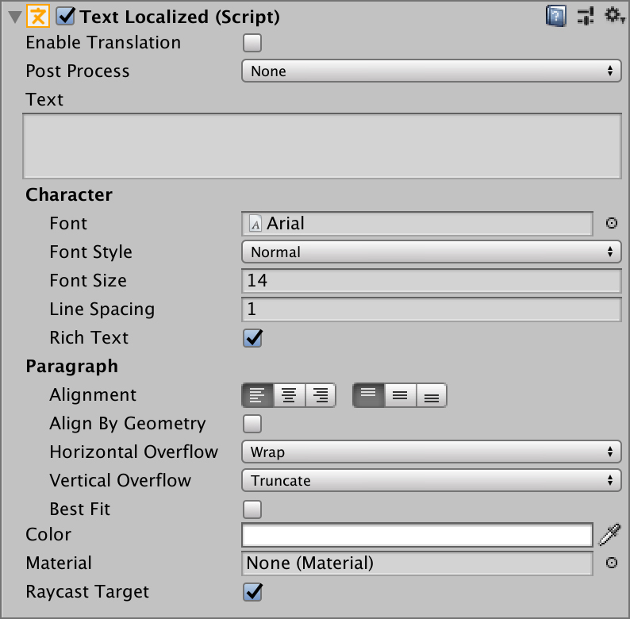
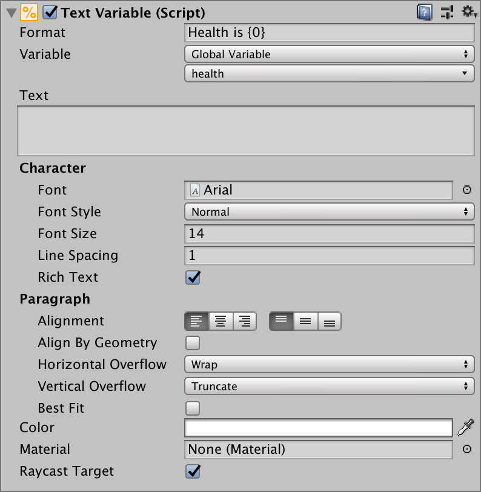

# UI

**Game Creator** comes with some handy components that makes interacting with **UI** elements a breeze.


It is recommended that you are at least familiar with **Unity**'s **UI** system. Check out [Unity Learn](https://learn.unity.com/) for more information.


All **Game Creator UI** components can be found at **`Create → Game Creator → UI`** section at the Hierarchy Panel. 

## Actions Button

Actions Button look exactly the same as native Unity buttons, except that there's an Actions component at the end of it that will be executed when the button is clicked.

## Input Field

Games usually allow the user to input a text. For example, the name of the player. You can easily store the value of an **Input Field** into a **Variable** through the **Game Creator Input Field**. 

This component looks exactly like the native homonymous but also has a **Variable** selector at the end.

## Slider

A **Slider** allows the user to select a value between a min and a max value. The **Game Creator Slider** allows to sync this value with a **Variable**.

The **Slider** value is updated when the **Variable** value is changed. The **Variable** value is also updated when the **Slider** value changes.

## Toggle

The **Toggle** component allows to set a **Variable** to _True_ or _False_ by checking or unchecking the box.

Game Creator allows to link this value to a Boolean Variable.

## Text Localized

Allows to print a **Localized Text** in a native-like **Text** component. The text is automatically updated if the user decides to change the game language.

To enable text localization, click on the **Enable Translation** button and a new entry will appear in the **Localized Texts** list. For more information about **Localized Texts** see its [section](localization.md).

## Text Variable

The **Text Variable** component looks exactly like the **Unity** **Text** component, except that its content allows to print the value of a **Variable**. The **Variable** value will replace the **`{0}`** symbol.

For example, if the text content is `"player health is {0}"` and the **Text Variable** component is linked to the "health" Variable, which has a value of 100, the runtime text will be `"player health is 100"`

