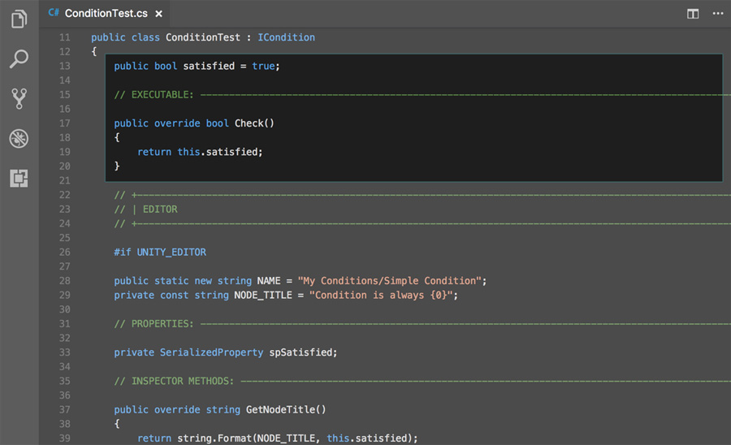

# Custom Conditions

Creating custom **Conditions** is much like creating custom **Actions** but even easier. If you haven't taken a look at how to create **Actions** it is encourage that you do so, as the process is practically the same.

To create a custom **Condition** right-click in the _Project Panel_, select `Create → GameCreator → Condition` and give it a suitable name. Because the template file is a too simple **Condition** example, we're going to create a more complex one through this manual. We're going to create a \*\*Condition that checks whether two objects are within a certain radius.


We use the convention **"Condition" +** **name**, but you can use whatever you like.



A **Condition** code is divided in a _runtime_ section and an _editor_ section.



The runtime section describes how it checks whether _something_ is true or false. To do so, declare your properties below the class definition and override the `Check` method. To create the new **Condition** let's remove the `isSatisfied` property and create 3 others:

```csharp
public Transform objectA;
public Transform objectB;
public float maxDistance = 5.0f;
```

And finally fill the `Check()` method. To check whether `objectA` is within a distance of `maxDistance` respect `objectB` we calculate the distance between the two objects and return if the value is lower than the threshold.

```csharp
public override bool Check(GameObject target)
{
    if (this.objectA == null) return false;
    if (this.objectB == null) return false;
​
    float distance = Vector3.Distance(
        this.objectA.position,
        this.objectB.position
    );
​
    return (distance <= this.maxDistance);
}
```


The _Editor_ section of a **Condition** is exactly as the **Action**. Check it out clicking [here](custom-actions.md#editor-body-example).


