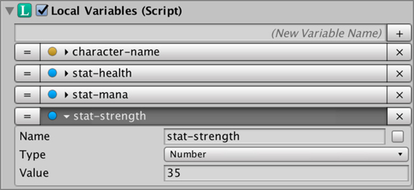
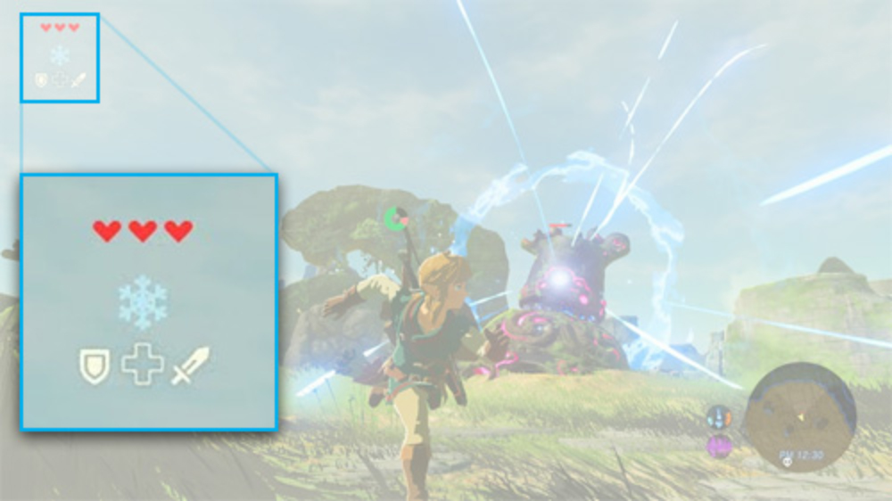

# Variables

**Game Creator** comes with a variables system that allows you to keep track of the game progress and save the state between play sessions.

A **variable** is a value container with information that can be changed during gameplay.


For example, in a **Zelda** game, the hearts at the top of the screen would be a variable identified by the name "_hearts_".


Variables can be **Global** or **Local**. For more information about **Global Variables** click [here](global-variables.md). To learn more about **Local Variables** click [here](local-variables.md).


Variables can also be accessed through code. Head to [Variables Access](../game-creator-api/variables-access.md) to know more.


## Anatomy of a Variable

A **variable** is has a `name` that identifies it \(for example: “shotgun ammo“\) and a `value`. 

A variable can have different types of values, including character **strings**, **numbers**, **booleans** \(on/off\), **Colors**, **Vector3**, and references to **Game** **Objects**, **Transforms**, **Rigidbodies**, etc...

Next to the name there's a checkbox. This allows to save the variable's state between play sessions.


Not all variable types allow to save its state. For example, **Game Objects** can't be saved because they are a reference type, which Unity doesn't allow to serialize.


