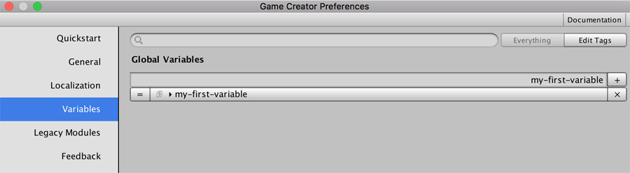
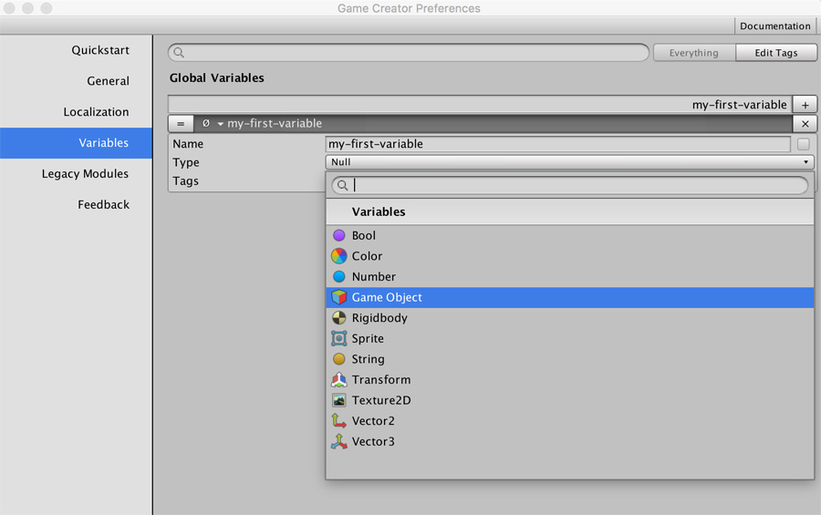

# Global Variables

**Global Variables** are project wide where you can store temporal and non-temporal values which can be changed in runtime. For example, if you allow users to pick the name of their characters, you can store the name they picked for their character in a **String Global Variable**.

## Creating and Editing

To create and edit global variables open the Preferences Menu \[⌘+P\] and select the Variables option.

To create a new global variable type in the name and press return or click on the `+` button. You'll create a variable of type `null`, which means it holds no value.

Choose which type of value a variable will hold. You can then initialize its default value.

## Saving Variables

Some variable types \(strings, numbers, booleans, Colors, ...\) can be saved between game sessions. This allows the player to pick up the game where they left when closing the application.


Not all variables can be saved between play sessions. For example, Game Objects can't be saved because they are references to scene objects and thus they might not be present when reloading a scene.


