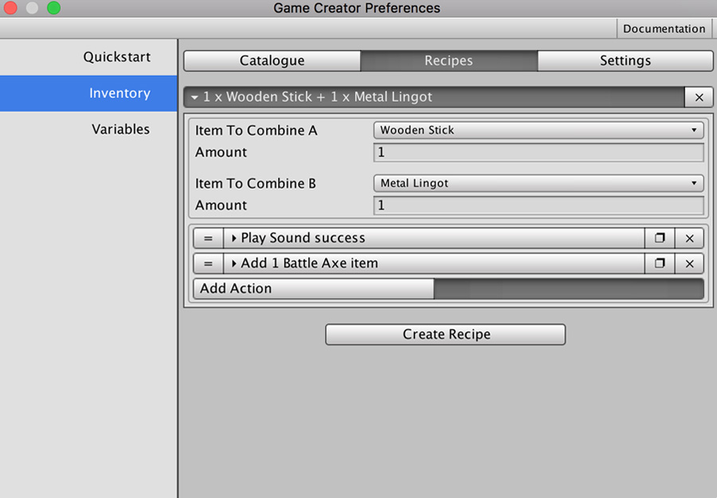

# Recipes

A **Recipe** is the definition of the output of combining two **Items**. For example, a **recipe** for creating a _sharp sword_ would be the combination of a _worn out sword_ **item** with a _grinder_ item.


Of course, similarly to what happens with **Items**, you are not limited to creating other items when combining two. You can do whatever you can think of as long as there's an **Action** that allows it.


Creating a **Recipe** is as easy as clicking on the "_Create Recipe_" button on the _Recipes_ tab in the _Preferences Window_. Then, select the two items you want to combine and the amount that are needed.

All that's left to do is specify the effects of combining two items.

In the previous screenshot, we can see how combining a **Wooden Stick** and a **Metal Lingot** will execute the **Actions** sequence defined below:

* Play a _success_ sound effect
* Give the player an item called _Battle Axe_

You can tell the game to combine two **Items** using the **Recipe Action** that comes with the **Inventory** module or dragging and dropping one item onto another one in the **Inventory UI**.

