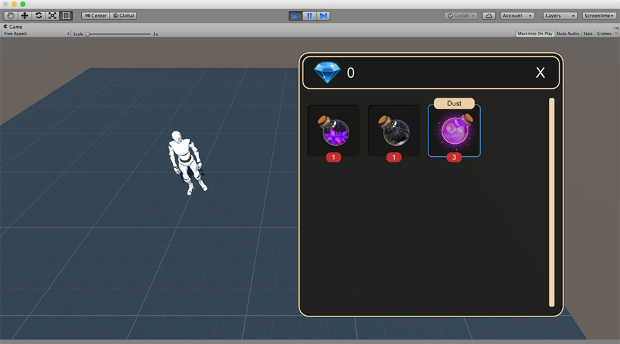

# Inventory

**Inventory** is a complete solution exclusively developed for **Game Creator** that allows to have a fully functional inventory system in your game in less than 30 seconds.


Download: [gamecreator.page.link/inventory](https://gamecreator.page.link/inventory).


## Key features 

* Create **Items** from the _Items Catalogue_ and define what happens when consumed.
* Create **Recipes** of two objects and customize the output using **Actions**.
* Use brand-new **Actions** to add, subtract, buy, sell and combine items.
* Built-in currency system to trade with other NPCs.
* Easy to customize **Inventory**'s **UI**.


**Inventory** comes with two examples of Inventory systems: One that emulates a typical **RPG** and another that looks like the old-school **Adventure** games from _Lucas Arts_.


## Setup 

Import the package and wait for the scripts to compile. _Voilá!_ You don't need to do everything else!


**Important!** This module requires **Game Creator** and won't work without it


