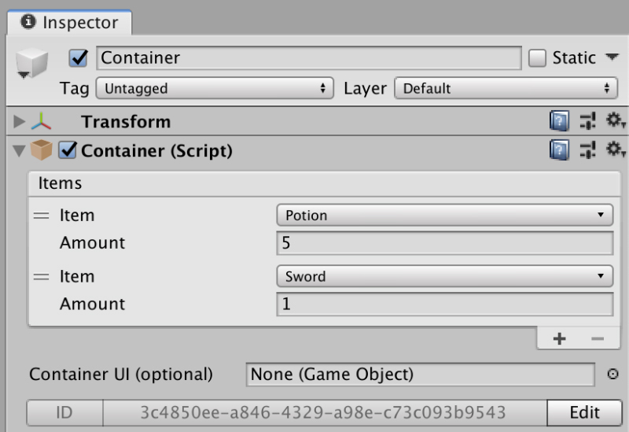

# Containers


**Containers** are a featured first introduced in version **0.6.1**


**Containers** allow to store and retrieve items. They come with a UI skin that allows to independently create a skin that fits the type of container.

It is important to note that a **Container** takes advantage of the **Save & Load** system that comes with **Game Creator** and automatically keeps track of the items added and removed, even between play sessions.


**Containers** are very useful for creating chests that are scattered around the world, which include valuable items and equipment.

But they can also be used in a more abstract way, allowing to use them as a a container to where dump the current **Inventory** items when switching between different playable characters \(who have different inventories\).


**Containers** can either be interacted through the Container UI or using the [Container](actions.md#container) **Actions**.

