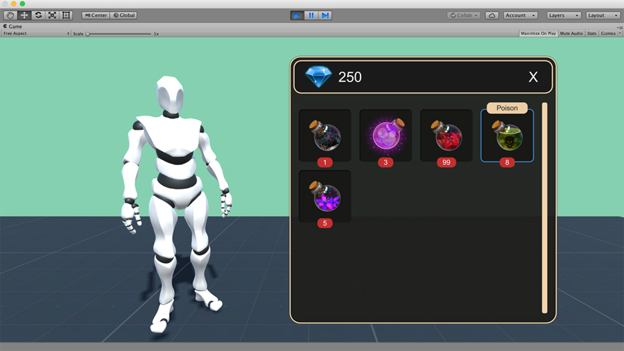
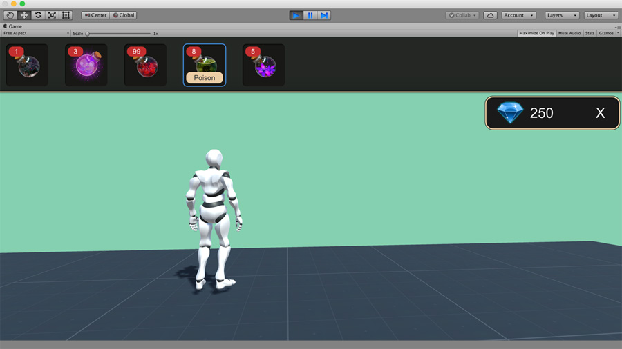
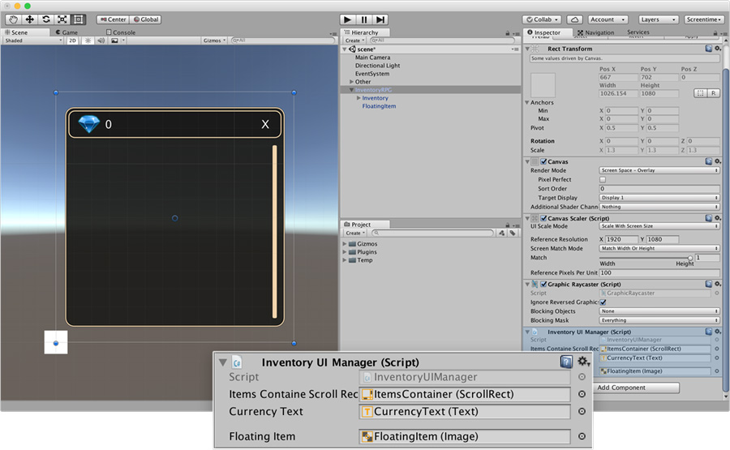
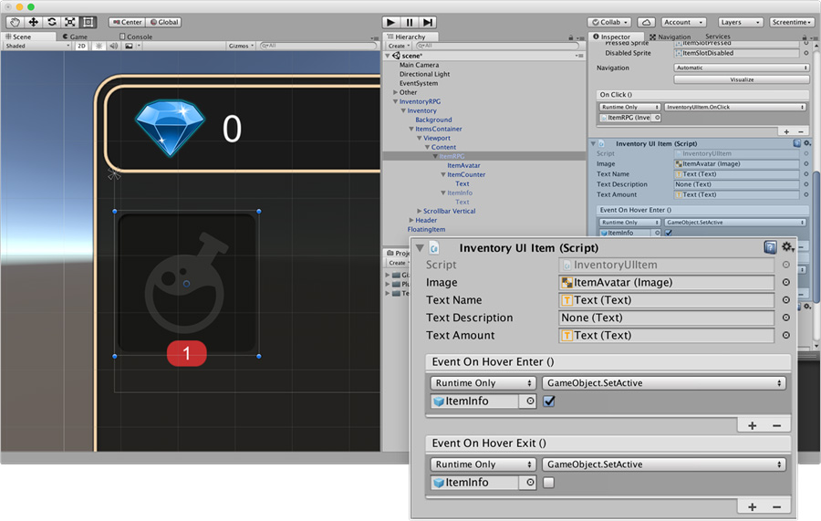
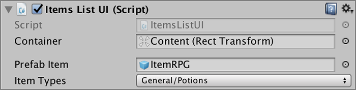
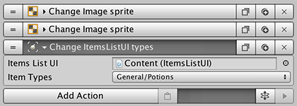
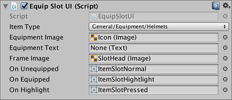

# Custom Inventory UI

Every game is unique in its own way and even though two games of the same genre might share some similarities, the truth is that there aren't two games with the same **inventory** visuals.

**Inventory** module comes with a couple of inventory representations. The first one is called **RPG Inventory UI** and looks very similar to the ones you find in most Western RPG games, such as _The Witcher 3: Wild Hunt_ or _The Elder Scrolls: Oblivion_ \(_Skyrim_ had a vertical layout\). These types of inventories occupy most of the screen space and are perfect to _do things_ within the inventory, such as combining items, consuming them, and so.

The other inventory representation reminds more of old-school adventure games such as _Day of the Tentacle_, _TellTale Game's Tales from the Borderlands_ or any _Room Escape_ game. These types of inventories leave as much screen space as possible and allow to drag and drop items onto the screen. These inventories are more fit if you intend to add more interaction outside the inventory than inside.

## UI Overview 

The only difference between these two inventories is their layout. Yes, seriously. We first created the **RPG Inventory**, we duplicated it and then, in less than 2 minutes, we had finished the **Adventure Inventory**.

An Inventory representation is composed of two prefabs:

* **Inventory UI Prefab**: Which is the actual representation of the inventory.
* **Item UI Prefab**: Which is the representation of an item that will be instantiated inside the **Inventory UI Prefab**.

We recommend that, if you want to create your own custom inventory, you duplicate any of the default prefabs we've set up.


You can find these prefabs at: Assets/Plugins/GameCreator/Inventory/Skins/


Once you duplicate any of the **Inventory UI** and **Item UI** prefabs, drag and drop them in the Settings menu of the Inventory's [Preference Window](inventory-window/).

## Customizing the Inventory UI

Customizing how the Inventory looks like is very easy. Just drop the duplicated prefab in the scene and change the sprites and layouts in order to look like how you want it.

The _items container_ \(where the items will be placed\) should have an [AutoLayout component](https://docs.unity3d.com/Manual/UIAutoLayout.html). An auto-layout component can be either a [HorizontalLayoutGroup](https://docs.unity3d.com/Manual/script-HorizontalLayoutGroup.html), a [VerticalLayoutGroup](https://docs.unity3d.com/Manual/script-VerticalLayoutGroup.html) or a [GridLayoutGroup](https://docs.unity3d.com/Manual/script-GridLayoutGroup.html).


Note that the **RPG Inventory UI** has a `GridLayoutGroup` while the **Adventure Inventory UI** has a `HorizontalLayoutGroup` for their items container.


In the prefab root object, you'll see a component named `Inventory UI Manager`. This script is responsible for managing the inventory's UI. Drag the `Scroll Rect` of your prefab's item container inside the scroll field.

The `Currency Text` field is optional. This will update the `Text` component every time the currency amount the player has changes.

The `Floating Item` field is used when an item is dragged around the inventory and is positioned below the cursor. You should leave this unchanged. If you feel the dragged item image is too small, you can modify the white sprite at the bottom of the inventory and make it bigger.

_Voilá_! That's all you need to know about customizing your inventory!

## Customizing the Items UI 

Customizing how the items appear is even easier than the inventory. To begin with, drop the duplicated prefab of the **RPG Item** in the _items container_ of the duplicated prefab of the **RPG Inventory** \(see the image below\). That way, you'll have a clean view of how it will look like.

The main component here is the `Inventory UI Item`. This scripts is responsible for showing how the item looks like. All its fields are optional, though it is recommended that you fill as much of them as possible.

For example, if you want to show the **Name** of the item, you can drag the `Text` component where name should appear and _Bam!_ magic. The name will appear during gameplay in that component.

You can choose to show different properties of an **Item**:

* The sprite associated with this item
* The item's name
* The item's description
* The amount of items you have in the inventory

Don't forget to save your prefab \(click _Apply_\) and delete it from the scene view.

## Advanced UI

The Inventory modules comes packed with some extra components that will help you build the perfect user interface for your game, in case none of the templates work for you.


This is meant for more advanced users and it is assumed that the user is fairly familiar with the Unity engine and its UI system.


### Items List UI

Since version 0.5.2 you can group items by type. For example, you might want to have your Equipment items in one tab and your Potions in another one.

In order to do so, you can use a component called **`Items List`**, under `Game Creator/UI` component path.

This component will display all items that belong to the ones selected in the Item Types dropdown menu and instantiate, for each matching item, an instance of the Prefab Item under the Container object.

You can change the type of items displayed at runtime using the **Items List UI** action.

### Equip Slot UI

Most PC or Mac games rely on drag and drop functionality to equip different objects, instead of using buttons. In order to to so with the Inventory module, you'll need to add an Equip Slot UI component on the image you want to use as the drop zone.

The **Item Type** field lets you select one single type of item, where the dropped item will be used for equipping.


In order for an item to be equipped, its type has to match the same as the one in the **`Item Type`** field of the **Equip Slot UI** component.


The rest of the fields are used to give visual feedback to the user.

