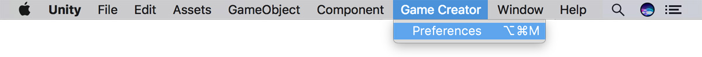

# Inventory Window

## Preferences 

Before jumping into the _game view_ you'll have to first define at least one **item**. **Items**, **Recipes** and everything related to the **Inventory** is located at the **Game Creator**'s preferences menu. To open it, simply click on the toolbar's _Game Creator_ button and select _Preferences_.

You can also open the **Preferences Window** using the keyboard shortcut `Shift + Ctrl + K` if you're on a Windows machine or `Shift + ⌘ + K` in macOS.

## Inventory Window 

Navigate to the **Inventory** left-sidebar button and you'll be presented with a screen with 4 options:

* ​[Catalogue](catalogue.md): Here you can create the game **Items** and give them properties
* ​[Recipes](recipes.md): In this tab you can specify what happens when combining two items.
* [Types](types.md): Create item types for better organization and equippable items.
* ​[Settings](settings.md): Everything related to the **Inventory**'s settings is here.

