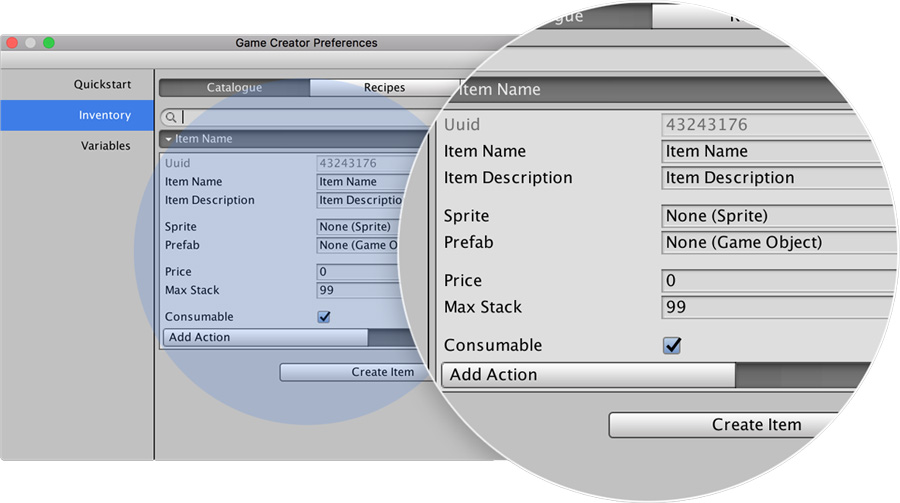
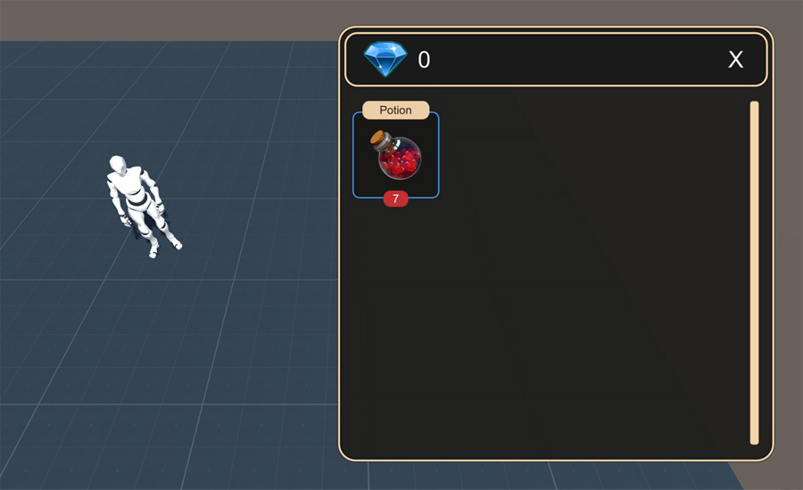

# Catalogue

**Items** are the main object of the **Inventory** module. The _Items Catalogue_ tab in the _Preferences Window_ allows to create and set the **Item**'s properties.

Here's an example of an empty **Item**:

An **Item** has quite a lot of options

* **Name**: The name of the item \(displayed in the UI\)
* **Description**: The description of the item \(displayed in the UI\)
* **Sprite**: The visual representation of the item \(as seen in the inventory UI\)
* **Prefab**: When dropping an item or instantiating it, this prefab will be used
* **Price**: The price this value costs \(used when buying or selling an item\)
* **Max Stack**: Maximum number of this items the player can carry in its inventory
* **Consumable**: Defines whether an item is consumable or not

If an item is marked as _consumable_ then the **Actions** defined below will be executed when the player clicks on the item in the **Inventory**'s **UI** or another **Action** forces to consume the item.

For example, if you create a **Health Potion** you'll want to restore some player's health \(which in this example will be saved in a **Variable**\). Then the **Item** would look like this.


Notice that you are not restricted to add effects to the player when consuming items. 

You could, for example, instantiate another **Character** in front of the player when consuming an item named _Magic Lamp_ which could be used to start a dialogue. 

The possibilities are only limited by your imagination!


