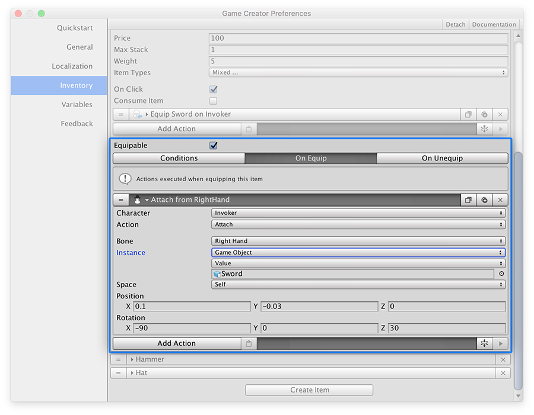

# Equip Items

Since version 0.5.1 you can create items and make characters equip them. We've built a very flexible system so one item can be equipped in multiple item slots \(although it can only be in either one or the other, but not both at the same time\). 


See [Item Types](types.md) section to know how to create and manage categories for different item types.


## Equip Items

To equip an item you first need to define which Types will be used as Equipping Slots. For example, you can make a _Steel Sword_ be of  **`Equipable`** and **`Equipable/Right-Hand`** Types.

Once you have these, you can use the Action "Equip Item" to equip the _Steel Sword_ to a specific slot, such as the type **Right Hand**.


Defining what items can be equipped is something that should be thought prior to start developing the game. It's advised to draft the amount of items that will be equipable and define their common types.


When an item is equipped, the **On Equip** actions will be fired, and when an item is unequipped, the **On Unequip** actions will be fired.


The **Invoker** property in these Action references the character that is equipping that item.


The **On Equip** and **On Unequip** actions are the perfect place to make the effects of equipping/unequipping an item take effect.

For example, if a _Steel Sword_ shows a nice 3D model of a shiny sword on its right hand, the **On Equip** Actions could look like something like this:


If you try to equip an item on a type that doesn't match the item's type, it won't equip the item.



When loading a previous game where the player or any other character had items equipped, those will be re-equipped.


