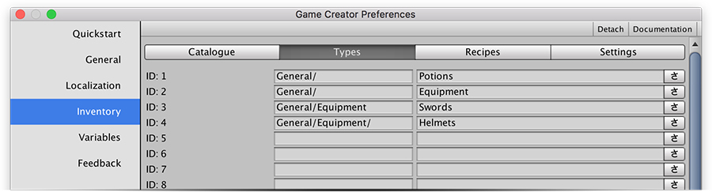

# Equip Items

Since version 0.5.1 you can create items and make characters equip them. We've built a very flexible system so one item can be equipped in multiple item slots \(although it can only be in either one or the other, but not both at the same time\). 

## Item Types

An item can be part of zero, one or more **Types**. **Types** are defined in the **Types** tab and have two fields: An **ID** and a **Name**.

An Item **Type** is identified by the concatenation of the **ID** and the **Name**. These should be unique across all other Types and can contain a "/" character to indicate being a sub-element of another item. In the example above, _Swords_ and _Helmets_ are sub elements of _Equipment_.


Though not required, it's a good practice to keep all sub elements with a "/" separator. This will allow finding sub items much faster, since they will be placed as a sub category when selecting a type in a dropdown menu.



You can create up to **32** different item **Types**.


Item **Types** can be used for a wide variety of reasons. One of them is using a **Type** to define which items are equipable and where can they be equipped. 


For example, you could assign the Type "_Right Hand_" to a _Sword_ and use all items that contain the type "_Right Hand_" as equipables to that slot.


Another use for **Types** is to organize the Player's inventory UI. You can choose to show specific items that belong to a category or multiple categories.


For example, you can define a "Consumable" type and assign it to Potions and Food so they are displayed in a consumable menu.


## Equip Items

To equip an item you first need to define which Types will be used as Equipping Slots. For example, you can make a _Steel Sword_ be of  **`Equipable`** and **`Equipable/Right-Hand`** Types.

Once you have these, you can use the Action "Equip Item" to equip the _Steel Sword_ to a specific slot, such as the type **Right Hand**.


Defining what items can be equipped is something that should be thought prior to start developing the game. It's advised to draft the amount of items that will be equipable and define their common types.


When an item is equipped, the **On Equip** actions will be fired, and when an item is unequipped, the **On Unequip** actions will be fired.


The **Invoker** property in these Action references the character that is equipping that item.


The **On Equip** and **On Unequip** actions are the perfect place to make the effects of equipping/unequipping an item take effect.

For example, if a _Steel Sword_ shows a nice 3D model of a shiny sword on its right hand, the **On Equip** Actions could look like something like this:


If you try to equip an item on a type that doesn't match the item's type, it won't equip the item.



When loading a previous game where the player or any other character had items equipped, those will be re-equipped.


